# Báo cáo nghiên cứu: Thiết kế và triển khai hệ thống TrustID Identity Fabric — ứng dụng Hyperledger Fabric trong quản lý danh tính nhân viên

---

## Tóm tắt đầu báo cáo (BLUF)

Báo cáo này đề xuất một kiến trúc **hybrid on-chain/off-chain** cho hệ thống quản lý danh tính và dữ liệu nhân sự TrustID, trong đó **MySQL đóng vai trò nguồn sự thật (source of truth)** chứa toàn bộ dữ liệu gốc (bao gồm PII đã mã hóa AES-256-GCM), còn **Hyperledger Fabric 2.5.4** chỉ lưu **SHA-256 hash của canonical JSON** cùng partial snapshot không nhạy cảm để phục vụ kiểm toán và phát hiện tampering. Thiết kế này đồng thời giải được ba bài toán khó: (1) xung đột giữa tính bất biến của blockchain và Điều 17 GDPR về quyền được lãng quên, (2) chi phí lưu trữ on-chain cao và (3) hiệu năng thấp của kiến trúc full-on-chain. Bài toán dual-write giữa MySQL và Fabric được giải quyết bằng **Transactional Outbox Pattern** kết hợp **fire-and-forget** và **exponential backoff**, đảm bảo tính nhất quán cuối cùng (eventual consistency) mà không làm blocking luồng nghiệp vụ chính. Toàn bộ backend Spring Boot 3 + Kotlin được tổ chức theo **Clean Architecture** của Robert C. Martin để bảo đảm tính độc lập giữa domain logic và các framework hạ tầng.

---

## 4.1. Kiến trúc tổng thể

### 4.1.1. Triết lý kiến trúc

TrustID Identity Fabric được thiết kế theo nguyên tắc **"blockchain là lớp audit, không phải lớp dữ liệu"**. Mỗi thao tác ghi dữ liệu nhân sự (tạo hồ sơ, ký hợp đồng, chấm công, duyệt nghỉ phép) được thực thi đồng thời trên hai lớp lưu trữ: **lớp giao dịch (transactional layer) là MySQL** chịu trách nhiệm lưu toàn bộ dữ liệu gốc với hiệu năng cao và khả năng truy vấn SQL phong phú; **lớp chứng thực (attestation layer) là Hyperledger Fabric 2.5.4** chỉ lưu dấu vân tay mật mã (SHA-256 digest) của bản ghi cùng metadata không nhạy cảm.

Lựa chọn Hyperledger Fabric thay vì các nền tảng blockchain public như Ethereum dựa trên ba lý do đã được kiểm chứng trong các nghiên cứu so sánh. Thứ nhất, Fabric là **permissioned blockchain** với cơ chế định danh X.509 quản lý qua MSP (Membership Service Provider), phù hợp với môi trường enterprise nơi mọi participant phải được định danh. Thứ hai, kiến trúc **execute-order-validate** của Fabric cho throughput cao hơn đáng kể so với kiến trúc **order-execute** của Ethereum — các benchmark độc lập ghi nhận Fabric đạt trên 3.500 TPS trong cấu hình phổ thông theo Androulaki và cộng sự (2018), và tối ưu hóa FastFabric của Gorenflo đạt xấp xỉ 20.000 TPS, trong khi Ethereum public chỉ ở mức 15–20 TPS. Thứ ba, Fabric không có cơ chế gas fee, cho phép chi phí vận hành dự đoán được.

### 4.1.2. Sơ đồ kiến trúc tổng thể (Deployment Diagram)

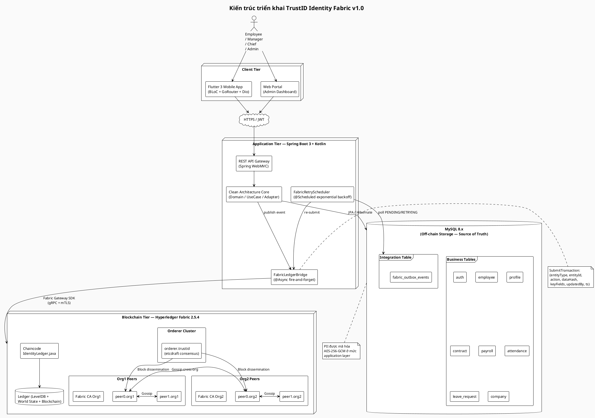

**Diễn giải.** Sơ đồ thể hiện ba lớp (tier) phân tách rõ ràng. **Client tier** gồm ứng dụng Flutter chạy trên thiết bị di động của nhân viên và portal web dành cho Admin/Chief. **Application tier** là backend Spring Boot 3 với Kotlin, tổ chức theo Clean Architecture; thành phần quan trọng nhất cho tích hợp blockchain là `FabricLedgerBridge` — service được đánh dấu `@Async` thực hiện submit transaction theo mô hình fire-and-forget, và `FabricRetryScheduler` — job `@Scheduled` thực hiện retry các event thất bại. **Blockchain tier** là mạng Hyperledger Fabric với hai tổ chức (Org1 và Org2), mỗi tổ chức có hai peer, một Fabric CA, cùng một orderer cluster sử dụng thuật toán đồng thuận **etcdraft**. Mũi tên hai chiều giữa các peer biểu diễn **gossip protocol** — cơ chế giúp các peer đồng bộ trạng thái ngang hàng mà không cần mọi peer đều kết nối trực tiếp đến orderer.

Luồng dữ liệu cơ bản: `User → Mobile/Web → REST API → Clean Architecture Core → MySQL (đồng bộ, commit) + Outbox event (cùng transaction) → FabricLedgerBridge (async) → Fabric Network → Ledger`. Nếu bước async thất bại, Retry Scheduler sẽ đọc bảng `fabric_outbox_events` theo trạng thái `PENDING` hoặc `RETRYING` và thử lại với exponential backoff.

### 4.1.3. Sơ đồ Use Case

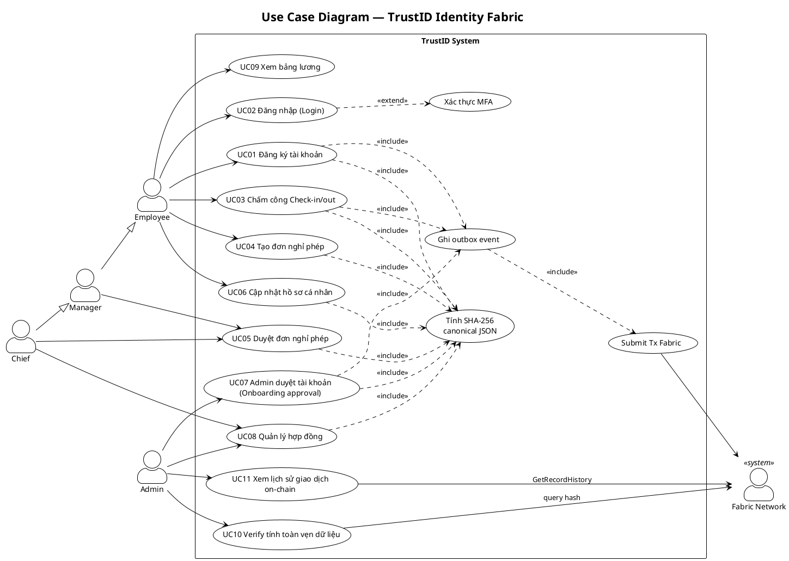

**Diễn giải.** Sơ đồ Use Case có bốn actor người dùng — `Employee`, `Manager`, `Chief`, `Admin` — và một actor hệ thống là `Fabric Network`. Quan hệ **generalization** `Manager ──▷ Employee` và `Chief ──▷ Manager` phản ánh thực tế tổ chức: Manager kế thừa mọi quyền của Employee, và Chief kế thừa mọi quyền của Manager. Điều này giúp tránh phải liệt kê lại các use case chung.

Ba use case **include** xuất hiện lặp lại thể hiện nguyên tắc tái sử dụng: mọi thao tác ghi dữ liệu quan trọng (UC01, UC03, UC04, UC05, UC06, UC07, UC08) đều bao hàm bước **Tính SHA-256 canonical JSON** và **Ghi outbox event**. Quan hệ **extend** giữa `UC_MFA` và UC02 thể hiện rằng xác thực đa yếu tố chỉ được kích hoạt tùy theo cấu hình của từng người dùng. Actor `Fabric Network` xuất hiện bên phải thay mặt cho mạng blockchain — đây là một "secondary actor" theo định nghĩa của Cockburn (2001), vì hệ thống backend chủ động gọi dịch vụ của Fabric chứ không phải ngược lại.

### 4.1.4. Kịch bản sáu use case chính

**UC01 — Đăng ký tài khoản.** *Tiền điều kiện:* Người dùng chưa có tài khoản TrustID. *Luồng chính:* (1) Nhân viên nhập thông tin cá nhân qua Flutter; (2) API nhận payload, validate định dạng và độ mạnh mật khẩu; (3) Password được hash bằng BCrypt work factor 12; (4) Tạo record `auth` và `employee` với trạng thái `PENDING_APPROVAL` trong MySQL; (5) Serialize thành canonical JSON theo RFC 8785, tính SHA-256; (6) Insert event vào `fabric_outbox_events` trong cùng transaction; (7) Commit; (8) Trả 201 Created cho client. *Hậu điều kiện:* Tài khoản tồn tại ở trạng thái chờ duyệt; event nằm trong outbox sẵn sàng để relay lên Fabric.

**UC02 — Đăng nhập.** *Tiền điều kiện:* Tài khoản đã được Admin duyệt. *Luồng chính:* (1) Client gửi `username + password`; (2) API load hash từ bảng `auth`, so sánh bằng `BCryptPasswordEncoder.matches`; (3) Nếu MFA được bật, gửi OTP qua email/SMS và yêu cầu nhập (nhánh extend); (4) Tạo JWT access token 15 phút và refresh token 7 ngày; (5) Ghi bản ghi `last_login` và tạo audit event login trên outbox. *Luồng thay thế:* Nếu status = `PENDING_APPROVAL` hoặc `LOCKED`, trả 403 kèm mã lỗi cụ thể.

**UC03 — Chấm công Check-in.** *Tiền điều kiện:* Đã đăng nhập. *Luồng chính:* (1) App gửi `check_in_time`, `geolocation`, `device_id`; (2) Validate geofence so với địa chỉ công ty; (3) Insert vào bảng `attendance`; (4) Hash canonical JSON với `keyFields = {employeeId, date, checkInTime, geoHash}`; (5) Insert outbox event action = `CHECK_IN`. *Đặc biệt:* Vì chấm công có giá trị pháp lý cao (tính lương, tranh chấp lao động), việc ghi hash lên blockchain giúp phát hiện mọi sửa đổi record attendance sau này.

**UC04 — Tạo đơn nghỉ phép.** Employee tạo `leave_request` với `from_date`, `to_date`, `leave_type`, `reason`. Trạng thái khởi tạo là `SUBMITTED`; hash được ghi ngay để cố định nội dung đơn — tránh trường hợp nhân viên sửa lý do sau khi đã nộp.

**UC07 — Admin duyệt tài khoản.** *Tiền điều kiện:* Tồn tại tài khoản `PENDING_APPROVAL`. *Luồng chính:* (1) Admin xem danh sách chờ duyệt; (2) Admin kiểm tra giấy tờ đính kèm; (3) Gọi API `PATCH /admin/accounts/{id}/approve` với ghi chú; (4) Cập nhật `auth.status = ACTIVE`, điền `approved_by`, `approved_at`; (5) Tạo outbox event `ACCOUNT_APPROVED` với partial snapshot chứa `{employeeId, approvedBy, approvedAt}`. *Hậu điều kiện:* Nhân viên có thể đăng nhập.

**UC10 — Verify tính toàn vẹn dữ liệu.** *Actor:* Admin/Auditor. *Luồng chính:* (1) Chọn entity cần kiểm tra (employee ID + loại bản ghi); (2) Backend load record từ MySQL; (3) Decrypt các field PII; (4) Canonicalize JSON theo RFC 8785; (5) Tính SHA-256 để thu `hash_computed`; (6) Gọi `EvaluateTransaction("VerifyRecord", entityId)` trên Fabric để lấy `hash_onchain`; (7) So sánh. Nếu khớp → trả `{verified: true}`; nếu khác → kích hoạt incident workflow (log, alert Slack, khóa tạm quyền chỉnh sửa).

### 4.1.5. Sơ đồ Sequence — Tạo Profile và ghi lên Blockchain

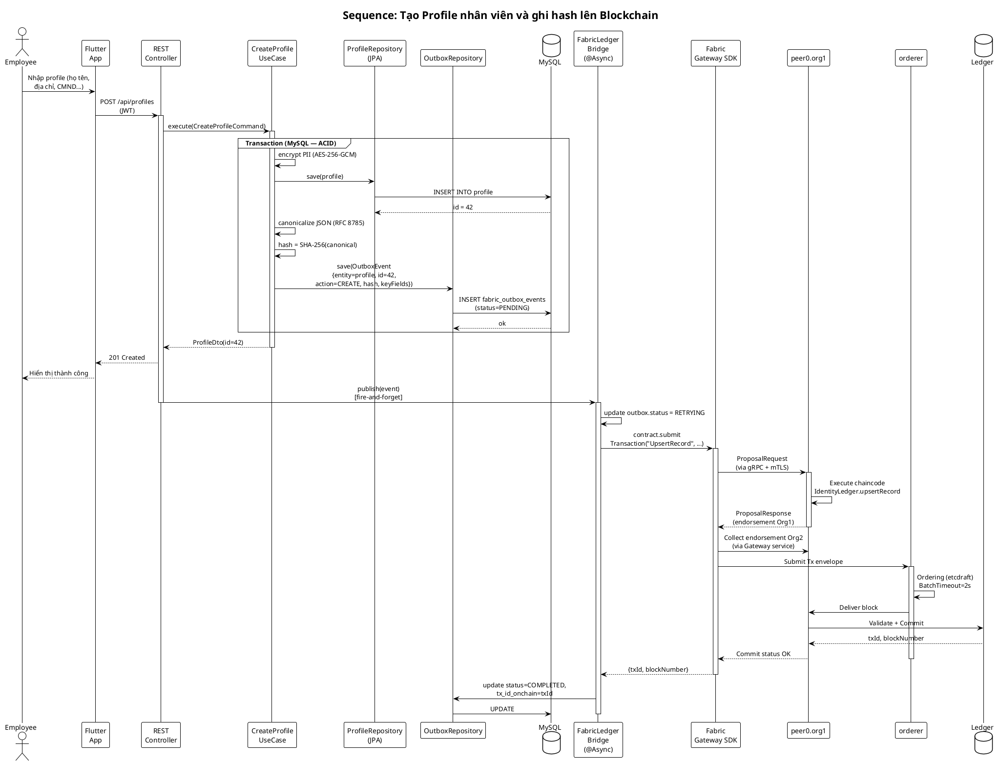

**Diễn giải.** Sơ đồ này minh họa một trong những luồng quan trọng nhất của hệ thống — tạo hồ sơ nhân viên và ghi chứng thực lên blockchain. Sơ đồ được chia rõ thành **hai pha bất đồng bộ**.

Pha thứ nhất (bên trong khung `group Transaction`) là pha **đồng bộ và đảm bảo ACID** trong MySQL: Use Case mã hóa PII, lưu bản ghi `profile`, sau đó trong cùng transaction đó insert thêm một event vào bảng `fabric_outbox_events`. Chính đặc điểm này — insert entity nghiệp vụ và event cùng một transaction — là cốt lõi của Transactional Outbox Pattern theo Richardson (2018) và giải quyết được dual-write problem. Ở cuối pha một, controller trả 201 Created ngay cho client: người dùng không phải chờ blockchain commit (thường tốn 1–3 giây).

Pha thứ hai (sau khi response đã trả) là pha **bất đồng bộ fire-and-forget**: `FabricLedgerBridge` được gọi với `@Async`, thực hiện submit transaction qua Fabric Gateway SDK. Chaincode `IdentityLedger.upsertRecord` được thực thi trên peer của Org1, sau đó tập hợp đủ endorsement của Org2 theo endorsement policy `AND(Org1.peer, Org2.peer)`, đẩy transaction envelope lên orderer, orderer gom batch với `BatchTimeout = 2s` rồi phát block ngược về các peer để validate và commit. Khi quá trình này thành công, Bridge cập nhật `outbox.status = COMPLETED`. Nếu bất cứ bước nào thất bại, trạng thái vẫn là `RETRYING` và Scheduler sẽ thử lại.

### 4.1.6. Sơ đồ Sequence — Fabric ghi lỗi → Outbox Retry

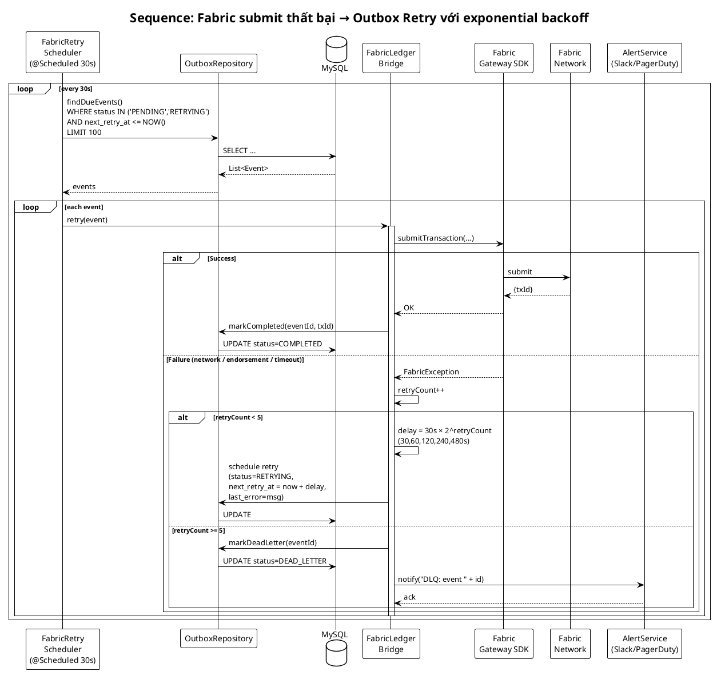

**Diễn giải.** Sơ đồ thể hiện cơ chế tự phục hồi (self-healing) khi submit transaction đầu tiên thất bại. Scheduler chạy mỗi 30 giây, quét bảng outbox tìm events "đến hạn thử lại" (`next_retry_at <= NOW()`). Với mỗi event, Bridge thử submit lại qua SDK.

Khối `alt Success/Failure` thể hiện hai nhánh xử lý. Nhánh thành công đơn giản cập nhật `COMPLETED`. Nhánh thất bại chia tiếp thành hai nhánh con dựa trên số lần đã thử: nếu `retryCount < 5`, tính delay theo công thức **exponential backoff**: `30s × 2^retryCount` tức 30s, 60s, 120s, 240s, 480s — tổng thời gian tối đa xấp xỉ 15,5 phút. Nếu sau 5 lần vẫn thất bại, event được chuyển sang trạng thái **DEAD_LETTER** và AlertService gửi thông báo cho đội vận hành.

Triết lý thiết kế là **không bao giờ drop event im lặng**: mọi event đều để lại dấu vết đầy đủ `last_error`, `retry_count`, `payload`, cho phép vận hành viên điều tra và phát lại thủ công sau khi root cause đã được xử lý.

### 4.1.7. Sơ đồ Sequence — Đăng ký → Onboarding → Admin duyệt → Login

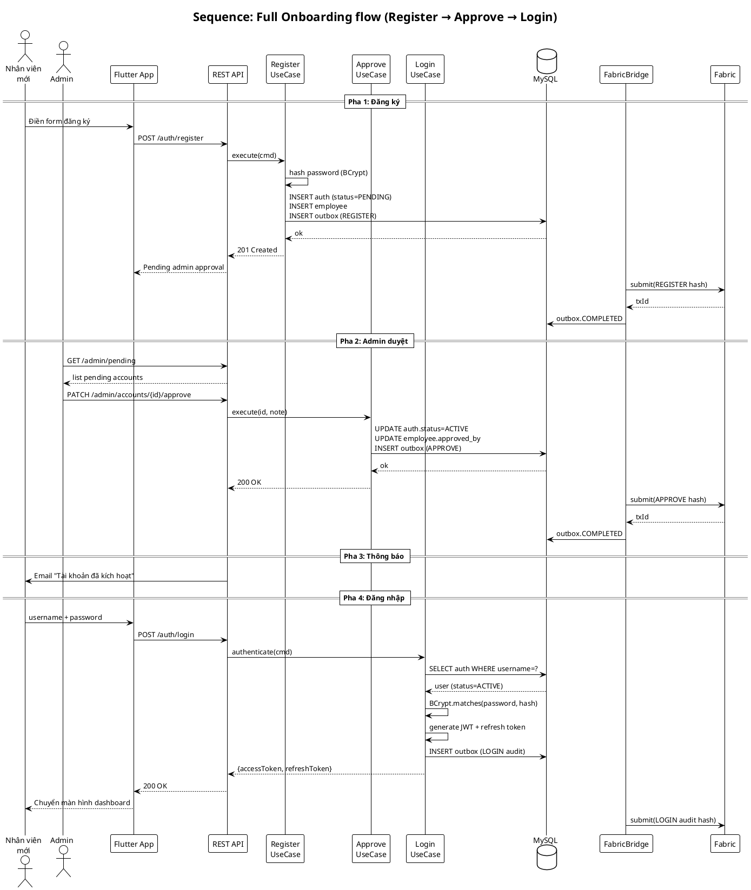

**Diễn giải.** Sơ đồ mô tả vòng đời onboarding hoàn chỉnh qua bốn pha tách biệt bằng các thanh chia `==`. Điểm đáng chú ý là **mỗi pha đều tạo một outbox event** — đăng ký (`REGISTER`), duyệt (`APPROVE`), thậm chí đăng nhập (`LOGIN audit`) — tạo nên một chuỗi audit bất biến trên blockchain, rất giá trị cho việc kiểm toán tuân thủ (compliance audit) sau này. Ví dụ, nếu phát sinh tranh chấp "ai đã duyệt tài khoản của X và vào lúc nào", nhà kiểm toán có thể query `GetRecordHistory` trên Fabric để truy vết toàn bộ state transitions mà không cần tin tưởng MySQL.

### 4.1.8. Sơ đồ Sequence — Verify tính toàn vẹn dữ liệu

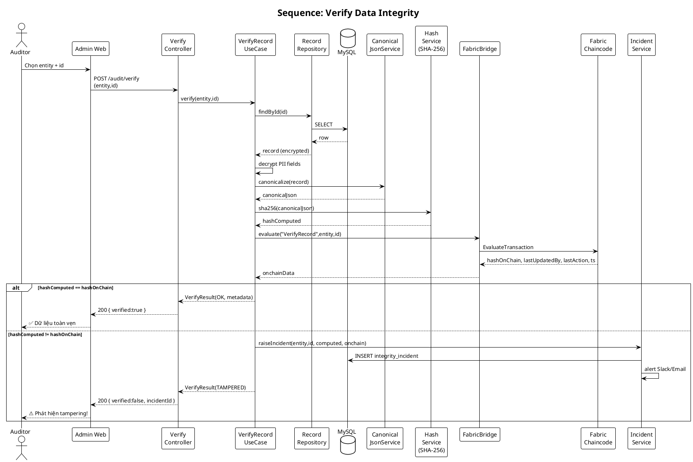

**Diễn giải.** Đây là luồng "crown jewel" của hệ thống — chứng minh giá trị thực sự của kiến trúc hybrid. Toàn bộ quá trình **không cần tin tưởng MySQL**: auditor tính hash trực tiếp từ dữ liệu hiện tại, rồi so sánh với hash đã được chứng thực bởi Fabric (và đồng thuận bởi Org1 + Org2) từ thời điểm ghi. Nếu hash khớp, dữ liệu trong MySQL không bị thay đổi trái phép kể từ thời điểm ghi chứng thực. Nếu không khớp, khả năng duy nhất là có ai đó (kể cả DBA nội bộ) đã sửa trực tiếp trong database mà không đi qua application — một dấu hiệu tampering rõ ràng, kích hoạt incident workflow.

Đặc biệt quan trọng, khối `else` sẽ raise incident với đầy đủ bằng chứng hai chiều: hash đã compute lại từ MySQL và hash on-chain. Bằng chứng này có giá trị pháp lý cao vì hash on-chain đã được ký bởi ít nhất hai tổ chức độc lập.

---

## 4.2. Thiết kế Blockchain

### 4.2.1. Network topology

Mạng blockchain TrustID là mạng **consortium permissioned** gồm hai tổ chức: **Org1** đại diện bộ phận HR và Ban giám đốc công ty, **Org2** đại diện bộ phận Audit/Compliance (hoặc một công ty kiểm toán bên thứ ba). Việc tách thành hai org độc lập là quyết định thiết kế then chốt — vì nó ngăn HR một mình thao túng dữ liệu: mọi giao dịch phải được endorsement bởi cả hai org theo chính sách `AND(Org1MSP.peer, Org2MSP.peer)`, nghĩa là ít nhất một peer của Org1 **và** ít nhất một peer của Org2 đồng thuận.

Mỗi tổ chức chạy hai peer (`peer0` và `peer1`) với vai trò mặc định là committer; `peer0` được đánh dấu là anchor peer để phục vụ gossip cross-org. Orderer cluster dùng giao thức đồng thuận **etcdraft** (triển khai Raft theo mô tả của Ongaro và Ousterhout, 2014) — một thuật toán crash fault tolerant, đơn giản và được cộng đồng Fabric sử dụng rộng rãi từ v1.4 thay thế cho Kafka.

Mỗi participant được cấp một X.509 certificate bởi Fabric CA tương ứng của org; các certificate này được quản lý bởi **Membership Service Provider (MSP)** — thành phần trừu tượng cung cấp định danh cho peer, orderer, chaincode và client. MSP là nơi cụ thể hóa triết lý "permissioned": mọi thao tác trên ledger đều gắn liền với một định danh đã được ủy quyền.

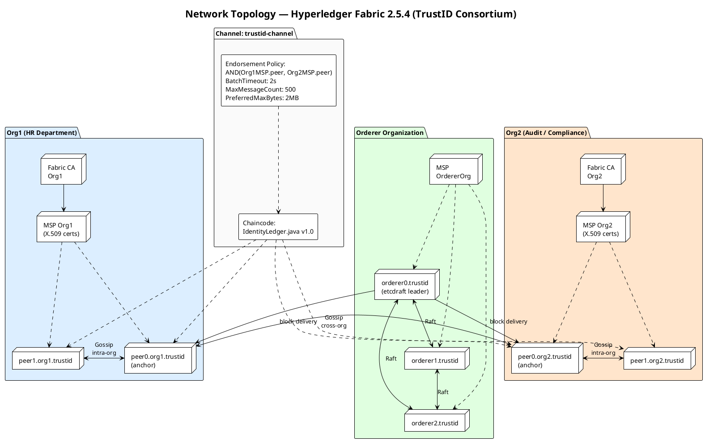

**Diễn giải.** Ba package màu đại diện ba MSP độc lập. Các đường gossip intra-org (bên trong một org) giúp state database đồng bộ nhanh giữa các peer của cùng org, trong khi gossip cross-org (giữa `peer0.org1` và `peer0.org2` ở vai trò anchor) giúp các org trao đổi thông tin về membership và block. Orderer cluster gồm ba node chạy Raft để đảm bảo khả năng chịu lỗi — với `n = 3`, cluster chịu được một node bị down mà vẫn hoạt động (quorum = 2).

### 4.2.2. Channel và Endorsement Policy

Hệ thống sử dụng **một channel duy nhất tên `trustid-channel`** vì tất cả dữ liệu nhân sự thuộc cùng một domain quyền riêng tư. Nếu trong tương lai cần tách kênh cho dữ liệu lương riêng (chỉ HR và giám đốc được xem), có thể tạo channel `payroll-channel` với membership subset.

Channel configuration chứa các policy dưới dạng implicit meta-policy và signature policy:

| Policy | Loại | Giá trị |
|---|---|---|
| `Channel/Application/Readers` | ImplicitMeta | `ANY Readers` |
| `Channel/Application/Writers` | ImplicitMeta | `ANY Writers` |
| `Channel/Application/Admins` | ImplicitMeta | `MAJORITY Admins` |
| `Channel/Application/Endorsement` | ImplicitMeta | `MAJORITY Endorsement` |
| Chaincode-level endorsement | Signature | `AND('Org1MSP.peer','Org2MSP.peer')` |

Giá trị `BatchTimeout = 2s` và `BatchSize.MaxMessageCount = 500`, `PreferredMaxBytes = 2 MB` là default của sample configtx.yaml — phù hợp cho workload HR với throughput vừa phải (ước tính 50–200 TPS). Batch timeout 2 giây là ngưỡng cân bằng tốt: không quá ngắn (gây nhiều block nhỏ, tốn bandwidth gossip), không quá dài (gây latency cao cho user).

**Gossip protocol** đóng ba vai trò. Thứ nhất, dissemination block từ leader peer (được bầu trong mỗi org) tới các peer còn lại để mọi peer đều có bản sao ledger mới nhất. Thứ hai, state synchronization khi một peer bị down và online lại — nó catch-up từ peer gần nhất thay vì pull lại từ orderer. Thứ ba, metadata exchange (heartbeat, membership) giúp mỗi org biết peer nào còn sống.

### 4.2.3. Chaincode IdentityLedger.java

Smart contract được viết bằng Java theo mô hình contract-API (annotation `@Contract`, `@Transaction` của `fabric-contract-api-java`). Gồm năm hàm chính:

```java
@Contract(name = "IdentityLedger")
public final class IdentityLedger implements ContractInterface {

    /** Create hoặc Update một record hash. */
    @Transaction(intent = Transaction.TYPE.SUBMIT)
    public String UpsertRecord(Context ctx,
                               String entityType, String entityId,
                               String action,        // CREATE | UPDATE
                               String dataHash,      // SHA-256 hex (64 chars)
                               String keyFieldsJson, // partial snapshot
                               String updatedBy,
                               String timestamp) { ... }

    /** Soft delete — ghi nhận action=DELETE mà vẫn giữ lịch sử. */
    @Transaction(intent = Transaction.TYPE.SUBMIT)
    public String DeleteRecord(Context ctx, String entityType, String entityId,
                               String updatedBy, String timestamp) { ... }

    /** Trả về hash và metadata mới nhất cho entity. */
    @Transaction(intent = Transaction.TYPE.EVALUATE)
    public String VerifyRecord(Context ctx, String entityType, String entityId) { ... }

    /** Trả toàn bộ lịch sử state transitions — cực kỳ giá trị cho audit. */
    @Transaction(intent = Transaction.TYPE.EVALUATE)
    public String GetRecordHistory(Context ctx, String entityType, String entityId) { ... }

    /** Truy vấn theo composite key. */
    @Transaction(intent = Transaction.TYPE.EVALUATE)
    public String QueryRecord(Context ctx, String entityType, String entityId) { ... }
}
```

Composite key được cấu trúc là `entityType~entityId` (ví dụ `employee~42`, `contract~E42-2026`) để có namespace rõ ràng và query prefix dễ dàng (`ctx.getStub().getStateByPartialCompositeKey("employee")` trả về mọi employee).

Giá trị được lưu on-chain cho mỗi record **không phải là dữ liệu gốc** mà là một JSON nhỏ gọn:

```json
{
  "entityType": "employee",
  "entityId": "42",
  "action": "UPDATE",
  "dataHash": "9f3c8a7d1b4e...e1a2 (64 hex chars)",
  "keyFields": {
    "employeeCode": "E042",
    "department": "ENG",
    "status": "ACTIVE"
  },
  "updatedBy": "admin@trustid.vn",
  "timestamp": "2026-04-17T08:30:00Z",
  "version": 3
}
```

`keyFields` là **partial snapshot** — các trường không nhạy cảm giúp người xem ledger có ngữ cảnh mà không cần truy ngược MySQL, nhưng **tuyệt đối không chứa PII** (không có CMND, địa chỉ, lương, số tài khoản ngân hàng).

### 4.2.4. Kiểu lưu dữ liệu: Partial snapshot + hash — phân tích sâu

Đây là quyết định thiết kế trọng tâm của toàn bộ dự án. Có bốn phương án khả dĩ cho bài toán "blockchain + dữ liệu nhân sự", mỗi phương án có ưu nhược rõ rệt.

**(a) Full on-chain — lưu toàn bộ dữ liệu gốc lên ledger.** Đơn giản về mặt lập trình. Nhưng có ba vấn đề trí mạng: (1) **chi phí lưu trữ on-chain rất cao** vì mỗi peer phải giữ toàn bộ lịch sử; một record lương 1 KB với 10.000 nhân viên và update hàng tháng tương đương 1,2 GB/năm nhân với số peer; (2) **PII trên ledger tồn tại vĩnh viễn** và sao chép trên mọi peer của mọi org, kể cả org của bên kiểm toán thứ ba — vi phạm nguyên tắc data minimization (GDPR Art. 5); (3) **không thể tuân thủ Điều 17 GDPR** về quyền được lãng quên vì blockchain không cho phép xóa.

**(b) Merkle tree root on-chain.** Gom batch records thành Merkle tree, chỉ ghi `root` lên chain. Tiết kiệm mạnh lần ghi. Ưu điểm: một root commit đồng thời cho N records. Nhược điểm: (1) cần quản lý off-chain metadata để tái dựng Merkle proof cho mỗi record; (2) khó query state cho từng record vì chỉ có root trên chain, phải tự lưu leaves + siblings; (3) phức tạp khi cần update một record — buộc phải rebuild tree hoặc áp dụng append-only model. Phù hợp hơn với log immutable (Certificate Transparency) thay vì HR data có update thường xuyên.

**(c) IPFS + hash on-chain.** Lưu JSON data lên IPFS, chỉ ghi CID lên chain. Có tính phi tập trung cao và self-verifying (CID *là* hash). Tuy nhiên: (1) **quản lý permission khó** — IPFS public thì ai có CID là truy cập được, private IPFS cluster lại mất tính phi tập trung; (2) **GDPR erasure khó đảm bảo** vì IPFS có cơ chế replicate không kiểm soát được, unpin không đồng nghĩa đã xóa; (3) HR query phức tạp (không có SQL); (4) thêm vận hành IPFS node không cần thiết khi công ty đã có MySQL.

**(d) Partial snapshot + hash on-chain (phương án của TrustID).** MySQL lưu toàn bộ data gốc (PII mã hóa), blockchain chỉ lưu SHA-256 hash + metadata không nhạy cảm. Đây là phương án được CNIL (2018) khuyến nghị trực tiếp: *"transactional data containing personal data should not be stored on the blockchain. Instead, the blockchain should only store a proof of existence of such data in the form of a commitment, hash function or ciphertext"*, và được EU Parliament Study 2019 xác nhận là "best practice".

Bảng so sánh tổng hợp bốn phương án:

| Tiêu chí | Full on-chain | Merkle root | IPFS + hash | Partial + hash (TrustID) |
|---|---|---|---|---|
| Chi phí lưu trữ on-chain | Rất cao | Thấp | Rất thấp | Thấp (≈300 B/tx) |
| PII leakage risk | Cao | Trung bình | Cao (nếu IPFS public) | Rất thấp |
| Tương thích GDPR Art. 17 | Không | Khó | Khó | **Có** (crypto-shredding) |
| Query từng record | Dễ | Khó | Khó | **Dễ** (SQL trên MySQL) |
| Batch verification | Tốn phí | Tốt nhất | Tốt | Tốt |
| Độ phức tạp triển khai | Thấp | Cao | Cao | Trung bình |
| Phù hợp HR system | ✗ | ✗ | ✗ | **✓** |

**Cơ chế crypto-shredding** trong TrustID là cốt lõi cho GDPR compliance. Khi một nhân viên thực hiện quyền được lãng quên: (1) row trong MySQL bị xóa hoặc overwrite NULL; (2) khóa mã hóa AES-256 dành cho record đó được destroy trong KMS — mọi backup encrypted lập tức trở nên vô nghĩa; (3) hash trên blockchain vẫn tồn tại nhưng không thể đảo ngược (one-way SHA-256, preimage resistance ≈ 2^256) và không chứa PII nên không còn là personal data dưới góc độ GDPR. Đây là lập luận được CNIL và các commentators pháp lý chấp nhận rộng rãi, dù EU Parliament Study 2019 ghi chú: *"Whether this hash (which cannot be deleted from the ledger) constitutes personal data is still unclear"*. EDPB Guidelines 02/2025 sau đó bổ sung hướng dẫn chi tiết hơn, yêu cầu DPIA trước khi triển khai.

---

## 4.3. Thiết kế dữ liệu

### 4.3.1. So sánh dữ liệu lưu Database vs Blockchain

| Thuộc tính | MySQL (off-chain) | Hyperledger Fabric (on-chain) |
|---|---|---|
| Vai trò | Source of truth | Attestation layer |
| Phạm vi dữ liệu | Toàn bộ (full record) | SHA-256 hash + partial snapshot |
| PII (CMND, lương, STK) | Có, mã hóa AES-256-GCM | **Không bao giờ** lưu |
| Khả năng sửa/xóa | Có (DELETE, UPDATE) | Không (immutable) |
| Khả năng truy vấn | SQL phong phú (join, index) | Theo composite key |
| Throughput | ~10.000 TPS | ~500–3.500 TPS |
| Latency | Millisecond | 1–3 giây (block time) |
| ACID | Có | Eventual + deterministic finality |
| Kiểm toán | Audit log (có thể bị xóa) | Lịch sử bất biến, đa bên đồng thuận |
| Role trong verification | Cung cấp data để hash | Cung cấp ground-truth hash |

### 4.3.2. Cơ chế sinh SHA-256 hash

Quy trình tạo hash cho mỗi record tuân theo năm bước đã được chuẩn hóa. **Bước một**, load record từ MySQL với tất cả các trường (bao gồm đã decrypt PII nếu cần). **Bước hai**, serialize thành JSON theo **JSON Canonicalization Scheme (JCS) — RFC 8785**: sắp xếp khóa của mỗi object theo thứ tự từ điển UTF-16 code-unit đệ quy, giữ nguyên thứ tự phần tử của array, chuẩn hóa số theo ECMAScript, loại bỏ whitespace dư thừa. **Bước ba**, chuyển canonical JSON thành byte sequence UTF-8. **Bước bốn**, áp thuật toán SHA-256 (NIST FIPS 180-4) lên byte sequence. **Bước năm**, mã hóa 32 byte digest thành 64 ký tự hex lower-case.

Ba tính chất mật mã của SHA-256 là nền tảng cho toàn bộ cơ chế verify: **tính một chiều (preimage resistance)** với độ khó xấp xỉ 2^256, nghĩa là không thể đi ngược từ hash về dữ liệu gốc; **kháng va chạm (collision resistance)** xấp xỉ 2^128, nghĩa là không thể tìm hai bản ghi khác nhau có cùng hash; **hiệu ứng tuyết lở (avalanche effect)** — thay đổi một bit của input khiến xấp xỉ 50% bit của output thay đổi, giúp phát hiện ngay cả sửa đổi nhỏ. Quan trọng, tính **deterministic** — cùng input luôn cho cùng output — là điều kiện bắt buộc để verify hoạt động, và chính vì lẽ đó bước JCS canonicalization không thể bỏ qua.

### 4.3.3. Sơ đồ ERD

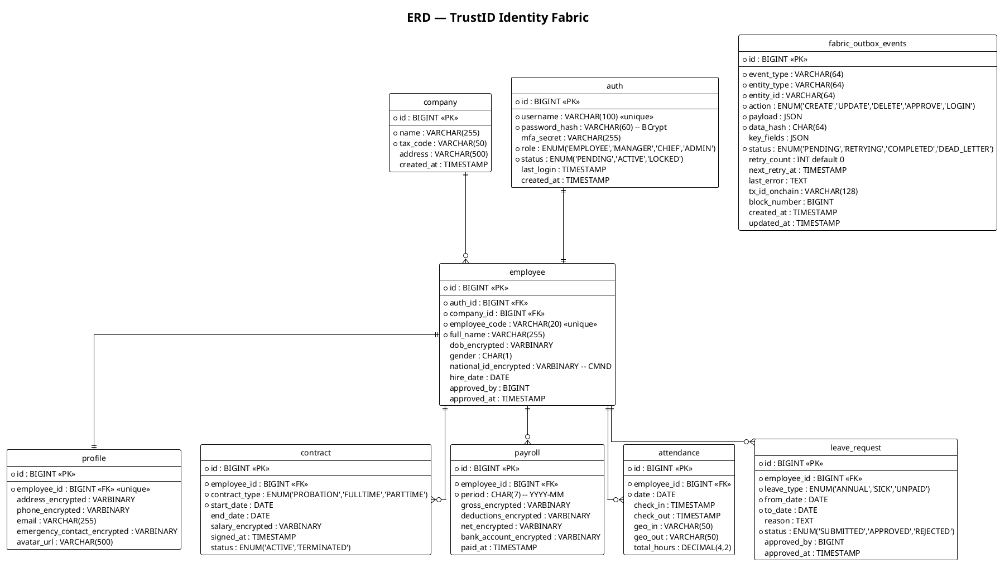

**Diễn giải.** Sơ đồ ERD theo ký pháp Crow's foot thể hiện tám bảng nghiệp vụ và bảng tích hợp `fabric_outbox_events`. Quan hệ chủ đạo là `employee` làm trung tâm — 1-1 với `auth` và `profile`, 1-n với `contract`, `payroll`, `attendance`, `leave_request`. Bảng `company` là mối 1-n với `employee`.

Các trường có hậu tố `_encrypted` đều là `VARBINARY` lưu ciphertext AES-256-GCM; khóa mã hóa được quản lý tách biệt trong KMS với envelope encryption pattern. Thiết kế không lưu khóa chung mà mỗi record có DEK riêng (Data Encryption Key), được wrap bởi KEK (Key Encryption Key) tổ chức — cho phép crypto-shredding ở mức từng nhân viên.

### 4.3.4. Vai trò của bảng `fabric_outbox_events`

Bảng outbox là **cầu nối giữa thế giới ACID của MySQL và thế giới eventually consistent của Fabric**. Có ba đặc tính thiết kế đáng chú ý.

**Đặc tính một: atomicity cục bộ.** Outbox record luôn được insert trong cùng một DB transaction với entity nghiệp vụ. Hoặc cả hai commit thành công, hoặc cả hai rollback. Điều này loại bỏ hoàn toàn khả năng "data đã vào MySQL nhưng event bị mất" — tức là giải dual-write problem mà không cần đến 2PC.

**Đặc tính hai: idempotent replay.** Cột `tx_id_onchain` chứa transaction ID mà Fabric trả về khi commit thành công. Nếu Bridge đã submit nhưng ghi update thất bại (vd. crash), lần retry sau có thể kiểm tra bằng cách query chaincode xem hash đã tồn tại chưa — tránh ghi duplicate.

**Đặc tính ba: state machine rõ ràng** (xem sơ đồ trạng thái tại mục 5.4).

Ngoài ra, thiết kế bảng outbox cho phép **at-least-once delivery guarantee** — tổ hợp với tính idempotent của chaincode (`UpsertRecord` là upsert theo composite key) tạo ra *effectively-once* semantics.

---

## 5. Triển khai (Implementation)

### 5.1. Công nghệ sử dụng

**Backend.** Spring Boot 3.2 + Kotlin 1.9 là lựa chọn chính vì ba lý do: (1) Kotlin có tính biểu đạt cao hơn Java cho các mẫu immutable data class, sealed class cho state machine; (2) Spring Boot 3 hỗ trợ Virtual Thread (Java 21) phù hợp với workload I/O-bound khi gọi Fabric qua gRPC; (3) hệ sinh thái `@Async`, `@Scheduled`, `@Transactional` của Spring cho phép triển khai Outbox Pattern rất gọn.

Backend được tổ chức theo **Clean Architecture** của Robert C. Martin, với bốn lớp đồng tâm và dependency rule một chiều từ ngoài vào trong.

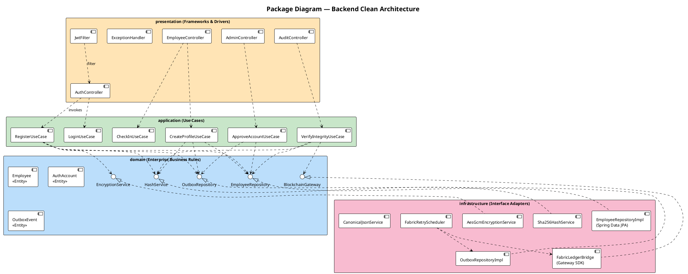

**Diễn giải.** Gói `domain` ở trung tâm chứa các entity thuần (pure Kotlin data class không phụ thuộc JPA) và các **interface** như `EmployeeRepository`, `BlockchainGateway`, `HashService`, `EncryptionService`. Gói `application` chứa các Use Case, mỗi Use Case là một class với đúng một method public thực thi một thao tác nghiệp vụ — tuân thủ Single Responsibility Principle. Gói `infrastructure` chứa các implementation cụ thể (JPA, Fabric SDK, SHA-256); chúng *implement* các interface trong `domain` (mũi tên `.up.|>`). Gói `presentation` là REST controller và filter.

Dependency rule được thể hiện qua hướng mũi tên: presentation → application → domain, và infrastructure → domain. **Không có mũi tên nào đi ra từ domain** — đây chính là bản chất "Dependency Inversion Principle" của Clean Architecture: domain là lớp trong cùng và không biết gì về Spring, JPA, Fabric SDK. Điều này cho phép: (1) thay MySQL bằng PostgreSQL chỉ bằng cách thay `EmployeeRepositoryImpl`; (2) mock mọi thứ trong unit test ở mức use case; (3) không bao giờ bị "Spring trộn lẫn vào business logic".

**Blockchain.** Hyperledger Fabric 2.5.4 LTS với chaincode viết bằng Java, chạy dưới chế độ **chaincode-as-a-service** (khuyến nghị của Fabric v2.4+) — chaincode nằm trong container riêng thay vì lifecycle theo peer, dễ scale và deploy hơn. Fabric Gateway SDK được dùng là `org.hyperledger.fabric:fabric-gateway` phiên bản hiện đại (v2.4+, dùng gRPC trực tiếp) thay vì SDK `fabric-gateway-java` legacy đã deprecated.

**Database.** MySQL 8.0 với InnoDB engine, transaction isolation `READ COMMITTED`, charset `utf8mb4_unicode_ci`. Index phục vụ outbox polling: `CREATE INDEX idx_outbox_status_retry ON fabric_outbox_events(status, next_retry_at)`.

**Container.** Docker + Docker Compose chạy tám service: hai Fabric CA (org1, org2), bốn peer (peer0/peer1 của hai org), một orderer, một CLI tool. Trong production mở rộng thành ba orderer để Raft có quorum 2 khi một node down.

**Frontend.** Flutter 3 với BLoC pattern cho state management, GoRouter cho navigation khai báo, Dio cho HTTP client (có auth interceptor, logging, retry). BLoC được chọn thay vì Provider hay Riverpod vì tính tách biệt rõ ràng giữa event/state và phù hợp cho test.

### 5.2. Setup network

Script `network.sh up` thực hiện tuần tự:

```bash
# 1. Sinh crypto material bằng cryptogen (dev) hoặc Fabric CA (prod)
./scripts/generate-crypto.sh
# 2. Sinh genesis block và channel transaction
./scripts/generate-channel-artifacts.sh
# 3. Start containers
docker compose -f docker/compose-fabric.yaml up -d
# 4. Tạo channel
./scripts/create-channel.sh trustid-channel
# 5. Join peers vào channel
./scripts/join-channel.sh
# 6. Deploy chaincode với endorsement policy
export CC_EP="AND('Org1MSP.peer','Org2MSP.peer')"
./scripts/deploy-chaincode.sh identityledger 1.0 "$CC_EP"
```

Tham số endorsement policy `AND('Org1MSP.peer','Org2MSP.peer')` được truyền qua flag `--signature-policy` của `peer lifecycle chaincode approveformyorg` và `peer lifecycle chaincode commit`. Bất kỳ transaction `UpsertRecord` hay `DeleteRecord` nào cũng phải thu thập endorsement từ **đồng thời một peer của Org1 và một peer của Org2** trước khi được gửi lên orderer.

### 5.3. Tích hợp backend với blockchain

`FabricLedgerBridge` là implementation của interface `BlockchainGateway` trong domain. Cấu trúc đơn giản hóa (Kotlin):

```kotlin
@Service
class FabricLedgerBridge(
    private val gateway: Gateway,      // singleton, managed by Spring
    private val outboxRepo: OutboxRepository,
    @Qualifier("fabricExecutor") private val executor: Executor
) : BlockchainGateway {

    @Async("fabricExecutor")
    override fun publish(event: OutboxEvent) {
        outboxRepo.markRetrying(event.id)
        try {
            val contract = gateway.getNetwork("trustid-channel")
                                  .getContract("identityledger")
            val txId = contract.submitTransaction(
                "UpsertRecord",
                event.entityType, event.entityId,
                event.action.name, event.dataHash,
                event.keyFieldsJson, event.updatedBy,
                event.timestamp.toString()
            ).let { String(it) }
            outboxRepo.markCompleted(event.id, txId)
        } catch (e: Exception) {
            handleFailure(event, e)
        }
    }
}
```

Annotation `@Async("fabricExecutor")` yêu cầu Spring chạy method này trên một `ThreadPoolTaskExecutor` riêng (không dùng thread pool chung với webserver) — tránh Fabric call làm nghẽn request thread. **Lưu ý quan trọng**: `@Async` hoạt động nhờ AOP proxy, nên `publish()` phải được gọi từ bean khác; self-invocation sẽ bỏ qua proxy và method chạy đồng bộ.

Controller gọi Bridge sau khi commit DB transaction, theo pattern fire-and-forget:

```kotlin
@Transactional
fun createProfile(cmd: CreateProfileCommand): ProfileDto {
    val profile = profileRepo.save(Profile.from(cmd))
    val event = OutboxEvent.create(profile, action = CREATE, hashService, canonJson)
    outboxRepo.save(event)
    return ProfileDto.from(profile).also {
        // sau khi commit, fire-and-forget qua transaction synchronization
        TransactionSynchronizationManager.registerSynchronization(
            object : TransactionSynchronization {
                override fun afterCommit() = bridge.publish(event)
            }
        )
    }
}
```

Việc dùng `afterCommit` đảm bảo Bridge chỉ được gọi khi transaction đã commit — tránh trường hợp transaction rollback nhưng event đã được publish (vi phạm atomicity).

### 5.4. Xử lý lỗi và đảm bảo tin cậy

Bảng `fabric_outbox_events` là "memory" của cơ chế tin cậy. Mỗi event đi qua state machine xác định.

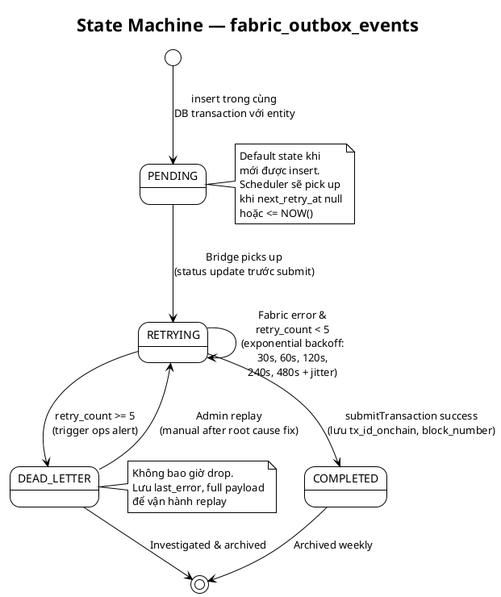

**Diễn giải.** State machine có bốn trạng thái và một transition đáng chú ý là `RETRYING → RETRYING` (self-loop), thể hiện vòng lặp retry với exponential backoff. Trạng thái `DEAD_LETTER` không phải terminal — vận hành viên có thể phát lại bằng cách reset `retry_count = 0` và `status = RETRYING` sau khi đã khắc phục nguyên nhân gốc (vd. Fabric network down, chaincode bug, expired certificate).

Exponential backoff với base 30 giây và hệ số 2 cho dãy delay `30, 60, 120, 240, 480` giây. Tổng thời gian tối đa trước khi vào DLQ xấp xỉ 15 phút 30 giây. Thêm jitter ±15% để tránh thundering herd khi nhiều event cùng fail (ví dụ khi Fabric restart đồng loạt).

Toàn bộ luồng ghi hybrid được tổng hợp ở sơ đồ activity dưới đây.

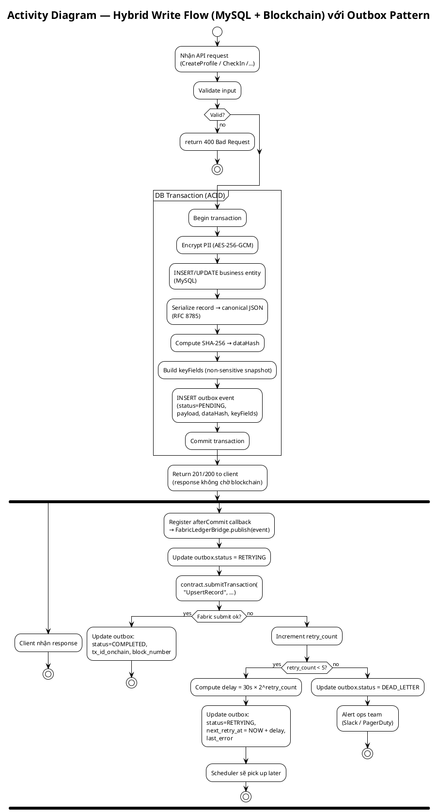

**Diễn giải.** Activity diagram nhấn mạnh **sự tách biệt giữa luồng đồng bộ trả response cho client và luồng bất đồng bộ ghi blockchain**. Partition `DB Transaction (ACID)` bao phủ toàn bộ các hành động phải atomic. Sau `Commit`, hệ thống ngay lập tức trả response cho client — đây là yếu tố quyết định để latency không bị kéo theo độ trễ của blockchain (vốn có thể lên đến vài giây).

Nhánh `fork` tượng trưng cho hai luồng chạy song song: một nhánh client kết thúc ngay, nhánh kia tiếp tục xử lý blockchain. Quyết định `Fabric submit ok?` phân thành ba kết cục: thành công (COMPLETED), còn retry (RETRYING với delay), hoặc hết retry (DEAD_LETTER).

**Eventual consistency guarantee.** Theo định nghĩa của Vogels (2009): "*the storage system guarantees that if no new updates are made to the object, eventually all accesses will return the last updated value*". Trong TrustID, cam kết chính xác là: *nếu không có Fabric network partition vĩnh viễn, mọi event trong outbox sẽ eventually được ghi lên ledger trong khoảng thời gian bị giới hạn bởi retry policy (~15 phút) hoặc được chuyển sang DLQ để can thiệp thủ công*. MySQL vẫn là source of truth cho read traffic; blockchain là attestation layer cho audit. Điều này hoàn toàn phù hợp với yêu cầu nghiệp vụ HR — không cần blockchain commit trước khi nhân viên có thể xem đơn nghỉ phép của mình.

---

## 6. Đánh giá thiết kế và hướng phát triển

Kiến trúc TrustID Identity Fabric thể hiện sự cân bằng có chủ đích giữa ba trục mâu thuẫn. Thứ nhất, **tính minh bạch bất biến của blockchain đối đầu với quyền riêng tư GDPR** — được giải bằng cách đặt blockchain ở vai trò attestation thay vì storage, kết hợp crypto-shredding. Thứ hai, **nhất quán mạnh ACID đối đầu với hiệu năng async** — được giải bằng Outbox Pattern giữ atomicity cục bộ và chuyển async-ness sang bridge layer. Thứ ba, **tính phức tạp kỹ thuật đối đầu với khả năng bảo trì** — được giải bằng Clean Architecture giữ domain thuần khiết, cách ly mọi framework ra lớp ngoài.

Các giới hạn còn tồn tại và hướng phát triển bao gồm: (a) hash on-chain vẫn là điểm mở về mặt pháp lý theo EU Parliament Study 2019, cần theo dõi EDPB Guidelines 02/2025 và án lệ tương lai; (b) endorsement policy `AND(Org1, Org2)` có latency cao hơn `OR`; nếu throughput cần tăng, có thể chuyển sang `OutOf(2, 'Org1.peer','Org2.peer','Org3.peer')` khi mở rộng consortium; (c) Merkle root batching có thể được bổ sung cho dữ liệu attendance tần suất cao (hàng nghìn check-in/ngày) để giảm số transaction on-chain; (d) tích hợp DID (Decentralized Identifier W3C v1.0/v1.1) để tiến tới mô hình self-sovereign identity cho nhân viên, cho phép mang theo chứng thực việc làm đến nhà tuyển dụng khác.

Tổng kết, thiết kế hybrid với **SHA-256 hash on-chain + partial snapshot, MySQL là source of truth, Outbox Pattern cho eventual consistency, Clean Architecture cho maintainability** là sự kết hợp đã được nhiều nguồn học thuật và cơ quan quản lý khuyến nghị, và phù hợp nhất cho bài toán quản lý danh tính nhân viên trong môi trường enterprise.

---

## Tài liệu tham khảo (IEEE)

[1] E. Androulaki, A. Barger, V. Bortnikov, C. Cachin, K. Christidis, A. De Caro, D. Enyeart, C. Ferris, G. Laventman, Y. Manevich, S. Muralidharan, C. Murthy, B. Nguyen, M. Sethi, G. Singh, K. Smith, A. Sorniotti, C. Stathakopoulou, M. Vukolić, S. W. Cocco, and J. Yellick, "Hyperledger Fabric: A Distributed Operating System for Permissioned Blockchains," in *Proc. 13th EuroSys Conf. (EuroSys '18)*, Porto, Portugal, Apr. 2018, Art. 30, pp. 1–15, doi: 10.1145/3190508.3190538.

[2] Hyperledger Foundation, *Hyperledger Fabric 2.5 LTS Documentation*. [Online]. Available: https://hyperledger-fabric.readthedocs.io/en/release-2.5/

[3] Hyperledger Foundation, "Endorsement Policies," *Hyperledger Fabric 2.5 Documentation*. [Online]. Available: https://hyperledger-fabric.readthedocs.io/en/release-2.5/endorsement-policies.html

[4] Hyperledger Foundation, "The Ordering Service," *Hyperledger Fabric 2.5 Documentation*. [Online]. Available: https://hyperledger-fabric.readthedocs.io/en/release-2.5/orderer/ordering_service.html

[5] Hyperledger Foundation, "Fabric Gateway," *Hyperledger Fabric Documentation*. [Online]. Available: https://hyperledger-fabric.readthedocs.io/en/latest/gateway.html

[6] Hyperledger Foundation, "Hyperledger Fabric Gateway Client API for Java." [Online]. Available: https://hyperledger.github.io/fabric-gateway/main/api/java/

[7] C. Gorenflo, S. Lee, L. Golab, and S. Keshav, "FastFabric: Scaling Hyperledger Fabric to 20,000 Transactions per Second," in *Proc. IEEE Int. Conf. Blockchain and Cryptocurrency (ICBC)*, 2019, arXiv:1901.00910.

[8] D. Ongaro and J. Ousterhout, "In Search of an Understandable Consensus Algorithm," in *Proc. USENIX Annu. Tech. Conf. (USENIX ATC '14)*, Philadelphia, PA, USA, Jun. 2014, pp. 305–320.

[9] R. C. Martin, *Clean Architecture: A Craftsman's Guide to Software Structure and Design*. Upper Saddle River, NJ, USA: Prentice Hall, 2017, ISBN 978-0-13-449416-6.

[10] R. C. Martin, "The Clean Architecture," *The Clean Code Blog*, Aug. 13, 2012. [Online]. Available: https://blog.cleancoder.com/uncle-bob/2012/08/13/the-clean-architecture.html

[11] C. Richardson, *Microservices Patterns: With Examples in Java*. Shelter Island, NY, USA: Manning Publications, 2018, ISBN 978-1-61729-454-9.

[12] C. Richardson, "Pattern: Transactional Outbox," *Microservices.io*. [Online]. Available: https://microservices.io/patterns/data/transactional-outbox.html

[13] C. Richardson, "Pattern: Transaction Log Tailing," *Microservices.io*. [Online]. Available: https://microservices.io/patterns/data/transaction-log-tailing.html

[14] M. Fowler, *Patterns of Enterprise Application Architecture*. Boston, MA, USA: Addison-Wesley, 2002, ISBN 978-0-321-12742-6.

[15] M. Fowler, "Repository," *Catalog of Patterns of Enterprise Application Architecture*. [Online]. Available: https://martinfowler.com/eaaCatalog/repository.html

[16] W. Vogels, "Eventually Consistent," *Commun. ACM*, vol. 52, no. 1, pp. 40–44, Jan. 2009, doi: 10.1145/1435417.1435432.

[17] S. Gilbert and N. Lynch, "Brewer's Conjecture and the Feasibility of Consistent, Available, Partition-Tolerant Web Services," *ACM SIGACT News*, vol. 33, no. 2, pp. 51–59, Jun. 2002.

[18] National Institute of Standards and Technology, *Secure Hash Standard (SHS)*, FIPS Publication 180-4, Aug. 2015. [Online]. Available: https://nvlpubs.nist.gov/nistpubs/fips/nist.fips.180-4.pdf

[19] National Institute of Standards and Technology, *Advanced Encryption Standard (AES)*, FIPS Publication 197 upd. 1, May 2023. [Online]. Available: https://nvlpubs.nist.gov/nistpubs/FIPS/NIST.FIPS.197-upd1.pdf

[20] M. Dworkin, *Recommendation for Block Cipher Modes of Operation: Galois/Counter Mode (GCM) and GMAC*, NIST Special Publication 800-38D, Nov. 2007.

[21] Q. Dang, *Recommendation for Applications Using Approved Hash Algorithms*, NIST Special Publication 800-107 Rev. 1, Aug. 2012.

[22] A. Rundgren, B. Jordan, and S. Erdtman, *JSON Canonicalization Scheme (JCS)*, IETF RFC 8785, Jun. 2020. [Online]. Available: https://www.rfc-editor.org/rfc/rfc8785

[23] R. C. Merkle, "A Digital Signature Based on a Conventional Encryption Function," in *Advances in Cryptology — CRYPTO '87*, Lecture Notes in Computer Science, vol. 293, C. Pomerance, Ed. Berlin, Heidelberg: Springer-Verlag, 1988, pp. 369–378, doi: 10.1007/3-540-48184-2_32.

[24] J. Benet, "IPFS — Content Addressed, Versioned, P2P File System (DRAFT 3)," *arXiv preprint* arXiv:1407.3561, Jul. 2014.

[25] S. Nakamoto, "Bitcoin: A Peer-to-Peer Electronic Cash System," 2008. [Online]. Available: https://bitcoin.org/bitcoin.pdf

[26] European Parliament and Council of the European Union, *Regulation (EU) 2016/679 (General Data Protection Regulation)*, Official Journal of the European Union, L 119, Apr. 27, 2016.

[27] M. Finck, *Blockchain and the General Data Protection Regulation: Can Distributed Ledgers Be Squared with European Data Protection Law?*, Study for the Panel for the Future of Science and Technology (STOA), European Parliamentary Research Service, PE 634.445, Jul. 2019.

[28] Commission Nationale de l'Informatique et des Libertés (CNIL), *Blockchain and the GDPR: Solutions for a Responsible Use of the Blockchain in the Context of Personal Data*, Sep. 2018 (English version, Nov. 2018). [Online]. Available: https://www.cnil.fr/sites/default/files/atoms/files/blockchain_en.pdf

[29] European Data Protection Board, *Guidelines 02/2025 on Processing of Personal Data Through Blockchain Technologies*, Apr. 14, 2025. [Online]. Available: https://www.edpb.europa.eu/system/files/2025-04/edpb_guidelines_202502_blockchain_en.pdf

[30] C. Allen, "The Path to Self-Sovereign Identity," *Life With Alacrity*, Apr. 25, 2016. [Online]. Available: https://www.lifewithalacrity.com/article/the-path-to-self-soverereign-identity/

[31] W3C, *Decentralized Identifiers (DIDs) v1.0 — W3C Recommendation*, Jul. 19, 2022. [Online]. Available: https://www.w3.org/TR/did-1.0/

[32] Y. Liu, D. He, M. S. Obaidat, N. Kumar, M. K. Khan, and K.-K. R. Choo, "Blockchain-Based Identity Management Systems: A Review," *J. Netw. Comput. Appl.*, vol. 166, art. 102731, Sep. 2020, doi: 10.1016/j.jnca.2020.102731.

[33] M. Kuperberg, "Blockchain-Based Identity Management: A Survey From the Enterprise and Ecosystem Perspective," *IEEE Trans. Eng. Manage.*, vol. 67, no. 4, pp. 1008–1027, Nov. 2020, doi: 10.1109/TEM.2019.2926471.

[34] S. Y. Lim, P. T. Fotsing, A. Almasri, O. Musa, M. L. M. Kiah, T. F. Ang, and R. Ismail, "Blockchain Technology the Identity Management and Authentication Service Disruptor: A Survey," *Int. J. Adv. Sci., Eng. Inf. Technol.*, vol. 8, no. 4-2, pp. 1735–1745, 2018, doi: 10.18517/ijaseit.8.4-2.6838.

[35] Q. Nasir, I. A. Qasse, M. Abu Talib, and A. B. Nassif, "Performance Analysis of Hyperledger Fabric Platforms," *Security and Commun. Netw.*, vol. 2018, art. 3976093, 2018, doi: 10.1155/2018/3976093.

[36] A. Lima, "Performance Analysis of Endorsement in Hyperledger Fabric Concerning Endorsement Policies," *Electronics*, vol. 12, no. 20, art. 4322, 2023, doi: 10.3390/electronics12204322.

[37] G. DeCandia et al., "Dynamo: Amazon's Highly Available Key-Value Store," in *Proc. 21st ACM SIGOPS Symp. Operating Systems Principles (SOSP '07)*, Stevenson, WA, USA, 2007, pp. 205–220, doi: 10.1145/1294261.1294281.

[38] Pivotal/VMware, "Task Execution and Scheduling," *Spring Framework Reference Documentation*. [Online]. Available: https://docs.spring.io/spring-framework/reference/integration/scheduling.html

[39] F. Angelov, "Bloc State Management Library." [Online]. Available: https://bloclibrary.dev/

[40] Flutter Team, "go_router: A Declarative Routing Package for Flutter," *pub.dev*. [Online]. Available: https://pub.dev/packages/go_router

[41] D. Eastlake 3rd and T. Hansen, *US Secure Hash Algorithms (SHA and SHA-based HMAC and HKDF)*, IETF RFC 6234, May 2011.

[42] A. Cockburn, *Writing Effective Use Cases*. Boston, MA, USA: Addison-Wesley, 2001, ISBN 978-0-201-70225-5.