# Báo cáo nghiên cứu — Phần bổ sung

## Đánh giá TrustID dưới góc độ Identity System chuẩn và Đặc tả chi tiết từng Use Case

---

## Phần 1. Đánh giá học thuật: TrustID có phải là một ứng dụng Identity chuẩn?

### 1.1. Định nghĩa "Identity System chuẩn" theo khung tham chiếu học thuật

Một hệ thống quản lý danh tính (Identity Management System — IdMS) chuẩn trong giai đoạn 2022–2026 được định nghĩa dựa trên ba khung tham chiếu chính:

**Thứ nhất, khung NIST SP 800-63-3/4 Digital Identity Guidelines** phân chia một hệ thống identity thành ba thành phần đo lường được: *Identity Assurance Level* (IAL, mức độ xác minh danh tính gốc), *Authenticator Assurance Level* (AAL, mức độ mạnh của cơ chế xác thực), và *Federation Assurance Level* (FAL, mức độ an toàn khi truyền assertion qua bên thứ ba). Mỗi mức có ba bậc (1, 2, 3) tương ứng các yêu cầu kỹ thuật cụ thể.

**Thứ hai, mô hình Self-Sovereign Identity (SSI)** do Christopher Allen đề xuất năm 2016 với mười nguyên tắc, bao gồm: tồn tại độc lập, kiểm soát bởi người dùng, khả chuyển (portability), minh bạch, bền vững, và đồng thuận. SSI được hiện thực hóa qua ba tiêu chuẩn W3C: *Decentralized Identifiers (DID) v1.0* (phê chuẩn 2022), *Verifiable Credentials Data Model v2.0* (2024), và *DIDComm Messaging*.

**Thứ ba, kiến trúc tam giác tin cậy (Trust Triangle)** gồm ba vai trò: *Issuer* (tổ chức cấp credential như công ty, trường đại học), *Holder* (chủ sở hữu credential, thường là cá nhân giữ trong wallet), *Verifier* (bên xác minh, ví dụ ngân hàng hỏi "người này có đang làm ở đâu không"). Blockchain trong mô hình này đóng vai trò *Verifiable Data Registry* lưu DID Document, schema, revocation registry — chứ không lưu credential.

Các dự án được coi là "blockchain identity chuẩn" phải thỏa mãn phần lớn các tiêu chí trên: Sovrin Network (Hyperledger Indy), Microsoft ION (Bitcoin-based), Hyperledger Aries, uPort/Veramo, và Veres One. Các dự án này đều phát hành DID cho chủ thể, cho phép chủ thể giữ credential trong ví cá nhân, hỗ trợ selective disclosure và có cơ chế revocation.

### 1.2. Đối chiếu TrustID với các tiêu chí chuẩn

Bảng đối chiếu toàn diện dưới đây cho thấy TrustID đáp ứng một số tiêu chí nhưng thiếu hụt các trụ cột quan trọng nhất của một identity system hiện đại.

| # | Tiêu chí | Mô tả | TrustID | Nhận xét |
|---|---|---|---|---|
| 1 | **DID (W3C DID v1.0)** | Định danh phi tập trung, không phụ thuộc nhà cung cấp | ❌ | Dùng `BIGINT auto_increment` và `UUID` — định danh tập trung |
| 2 | **Verifiable Credentials** | Credential ký số, có thể verify offline | ❌ | Không có concept credential riêng biệt |
| 3 | **Selective disclosure** | Chia sẻ có chọn lọc từng thuộc tính | ❌ | Dữ liệu nằm trong MySQL dưới sự kiểm soát của app |
| 4 | **Zero-knowledge proof** | Chứng minh thuộc tính mà không lộ giá trị | ❌ | Không có |
| 5 | **User-controlled wallet** | Nhân viên giữ khóa và credential | ❌ | Dữ liệu thuộc sở hữu công ty, lưu trong MySQL |
| 6 | **Credential portability** | Mang credential sang nhà tuyển dụng khác | ❌ | Không có cơ chế xuất credential |
| 7 | **Revocation registry** | Cơ chế thu hồi credential | Một phần | Có cơ chế "chấm dứt hợp đồng" nhưng không chuẩn hóa |
| 8 | **DIDComm / protocol chuẩn** | Giao thức trao đổi chứng thực P2P | ❌ | Dùng REST/JSON tự định nghĩa |
| 9 | **Federation (OIDC/SAML)** | Liên thông với IdP bên ngoài | ❌ | Chỉ có JWT cục bộ |
| 10 | **Identity Proofing (IAL)** | Xác minh danh tính gốc khi đăng ký | Yếu | Chỉ dựa vào Admin duyệt thủ công |
| 11 | **Multi-factor Auth (AAL2/3)** | Tương đương chuẩn NIST | Không rõ | Mật khẩu + JWT = AAL1 |
| 12 | **Audit trail bất biến** | Blockchain immutable log | ✅ | **Đây là điểm mạnh duy nhất gắn với blockchain** |
| 13 | **Hybrid on-chain/off-chain** | Tách PII và hash | ✅ | Thiết kế tốt |
| 14 | **GDPR-aware** | Hỗ trợ quyền được lãng quên | ✅ | Có crypto-shredding |
| 15 | **RBAC** | Phân quyền theo vai trò | ✅ | Có 4 cấp |
| 16 | **Tamper evidence** | Phát hiện sửa đổi trái phép | ✅ | Có cơ chế verify hash |

**Tỷ lệ đáp ứng: 5/16 tiêu chí (31%).** Đáng lưu ý là các tiêu chí được đáp ứng (12–16) đều thuộc nhóm *audit và data integrity*, không phải nhóm *identity* theo nghĩa đen.

### 1.3. TrustID thực chất là gì?

Đánh giá khách quan, TrustID nên được mô tả chính xác hơn bằng một trong các thuật ngữ sau:

- **"Blockchain-anchored HRMS"** (Hệ quản trị nhân sự được neo trên blockchain) — thuật ngữ gần gũi với mô tả thực tế nhất.
- **"Tamper-evident employee records system"** (Hệ thống bản ghi nhân sự chống giả mạo) — nhấn mạnh giá trị cốt lõi.
- **"Hybrid on-chain audit platform for HR"** (Nền tảng audit lai cho HR).

Giá trị thực sự của hệ thống nằm ở chỗ **"không ai — kể cả DBA, kể cả Admin — có thể sửa dữ liệu nhân sự mà không để lại dấu vết đã được đồng thuận bởi Org1 và Org2"**. Đây là use case hoàn toàn hợp lệ và có giá trị thương mại cao, đặc biệt trong các bối cảnh:

- Tranh chấp lao động (nhân viên khiếu kiện về lương, thời gian làm việc).
- Thanh tra thuế và BHXH (kiểm tra danh sách nhân viên, hợp đồng lao động).
- Kiểm toán tài chính (chứng minh quỹ lương không bị khai khống).
- Due diligence khi M&A (bên mua xác minh số lượng nhân sự thực).

### 1.4. Khoảng cách so với identity system chuẩn và lộ trình nâng cấp

Để đưa TrustID tiệm cận với một identity system chuẩn, cần bổ sung năm nhóm tính năng theo thứ tự ưu tiên:

**Giai đoạn 1 — DID Foundation (3–6 tháng).** Cấp mỗi nhân viên một DID theo phương pháp `did:fabric:<channel>:<identifier>` hoặc dùng phương pháp phổ quát `did:web:<company>/<employeeCode>`. DID Document chứa public key của nhân viên, được lưu trên chaincode. Bảng `employee` thêm cột `did` UNIQUE.

**Giai đoạn 2 — Verifiable Credentials (6–9 tháng).** Phát hành credential cho các sự kiện lớn: *EmploymentCredential* (khi tuyển dụng), *PromotionCredential* (khi thăng chức), *SalaryRangeCredential* (dải lương, không phải con số cụ thể), *TrainingCompletionCredential* (khi hoàn thành đào tạo). Credential được ký bằng khóa riêng của công ty (DID của Org1), lưu tham chiếu trên chaincode nhưng bản thân VC được lưu trong Flutter wallet của nhân viên.

**Giai đoạn 3 — Revocation & Selective Disclosure (9–12 tháng).** Triển khai status list 2021 hoặc cryptographic accumulator để thu hồi credential khi nhân viên nghỉ việc. Áp dụng BBS+ signature hoặc SD-JWT để cho phép selective disclosure.

**Giai đoạn 4 — Federation & Interoperability (12–18 tháng).** Tích hợp OIDC4VC để các bên thứ ba (ngân hàng cho vay, nhà tuyển dụng tương lai, cơ quan chính phủ) có thể yêu cầu và verify credential từ nhân viên qua chuẩn mở. Tương thích với EUDI Wallet theo Regulation (EU) 2024/1183.

**Giai đoạn 5 — Compliance Formalization (18–24 tháng).** Chứng nhận tuân thủ NIST SP 800-63-4 ở mức IAL2/AAL2/FAL2, ISO/IEC 27001, và SOC 2 Type II.

### 1.5. Kết luận đánh giá

TrustID **là một thiết kế kỹ thuật tốt cho bài toán audit trail nhân sự**, thể hiện qua việc áp dụng hợp lý các pattern học thuật (Transactional Outbox, Clean Architecture, hybrid storage). Tuy nhiên, nó **chưa phải là identity system chuẩn** theo định nghĩa của W3C DID/VC, NIST SP 800-63, hay Self-Sovereign Identity. Việc gọi đây là "Identity Fabric" là một lựa chọn marketing hơn là mô tả kỹ thuật chính xác.

Khi trình bày trong một báo cáo nghiên cứu học thuật, nên đặt lại tên hệ thống theo một trong các hướng: *"TrustID: A Blockchain-Anchored Employee Records System with Tamper-Evident Audit Trail"* hoặc *"TrustID: Hybrid On-chain/Off-chain HRMS for Data Integrity Assurance"* — vừa chính xác về mặt khoa học, vừa nêu bật đúng đóng góp kỹ thuật của đề tài.

---

## Phần 2. Đặc tả chi tiết từng Use Case và Sequence Diagram

Phần này đặc tả **26 use case** được gom thành chín nhóm chức năng. Mỗi use case gồm: bảng kịch bản đầy đủ (actor, mục tiêu, tiền/hậu điều kiện, luồng chính, luồng thay thế, ghi chú blockchain) và sequence diagram riêng biệt mô tả chi tiết tương tác giữa các thành phần.

### Nhóm A — Authentication & Account Lifecycle

#### UC-01: Đăng ký tài khoản

| Trường | Nội dung |
|---|---|
| **Mã UC** | UC-01 |
| **Tên** | Đăng ký tài khoản (Sign Up) |
| **Actor chính** | Nhân viên mới (chưa có tài khoản) |
| **Actor phụ** | MySQL, FabricLedgerBridge |
| **Mục tiêu** | Tạo tài khoản cơ bản trong hệ thống ở trạng thái PENDING |
| **Phạm vi** | TrustID Backend + Fabric Network |
| **Mức độ** | User goal |
| **Tiền điều kiện** | Email/SĐT chưa tồn tại trong bảng `auth` |
| **Hậu điều kiện thành công** | `auth` row được tạo với `status=PENDING`, outbox event `ACCOUNT_CREATED` được enqueue, JWT tạm được trả về để tiếp tục onboarding |
| **Hậu điều kiện thất bại** | Không có row nào được tạo, lỗi 409 được trả |
| **Trigger** | Người dùng nhấn nút "Đăng ký" trên màn hình Sign Up |
| **Luồng chính** | 1. Client gửi `{email, phone, password, confirmPassword}` qua `POST /api/v1/auth/sign-up` 2. Controller validate định dạng email, độ mạnh mật khẩu (≥8 ký tự, có chữ hoa, số) 3. UseCase kiểm tra `auth.email` và `auth.phone` chưa tồn tại 4. Password được hash bằng BCrypt với work factor 12 5. Trong cùng transaction DB: INSERT `auth` (status=PENDING), INSERT `fabric_outbox_events` 6. Commit transaction 7. Sinh JWT tạm (15 phút) chứa `userId` và scope `ONBOARDING_ONLY` 8. Trả 201 Created + `{token, userId}` 9. `@Async` Bridge submit hash lên Fabric |
| **Luồng thay thế 2a** | Validate fail → trả 400 Bad Request với chi tiết lỗi |
| **Luồng thay thế 3a** | Email/phone trùng → trả 409 Conflict `{code: "AUTH_EXISTS"}` |
| **Luồng thay thế 9a** | Fabric lỗi → outbox event giữ `status=PENDING`, scheduler retry |
| **Ghi blockchain** | ✅ Có — `action=CREATE`, `entityType=auth`, `keyFields={email_masked, phone_masked, role}`, `dataHash=SHA256(canonical)` |
| **Yêu cầu phi chức năng** | Response time ≤ 500ms (không chờ Fabric); BCrypt ≥ 200ms để chống brute force |

**Sequence Diagram UC-01:**

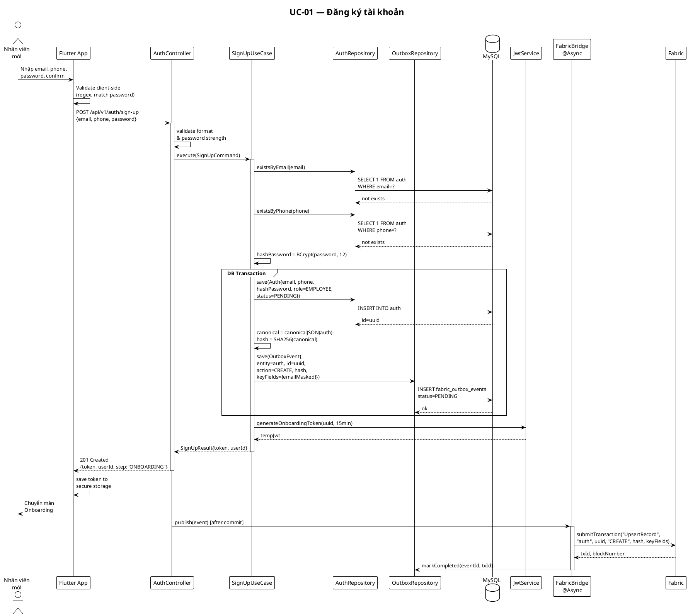
```plantuml
@startuml
!theme plain
title UC-01 — Đăng ký tài khoản

actor "Nhân viên\nmới" as User
participant "Flutter App" as App
participant "AuthController" as Ctrl
participant "SignUpUseCase" as UC
participant "AuthRepository" as AR
participant "OutboxRepository" as OR
database "MySQL" as DB
participant "JwtService" as JWT
participant "FabricBridge\n@Async" as FB
participant "Fabric" as FC

User -> App : Nhập email, phone,\npassword, confirm
App -> App : Validate client-side\n(regex, match password)
App -> Ctrl : POST /api/v1/auth/sign-up\n{email, phone, password}
activate Ctrl
Ctrl -> Ctrl : validate format\n& password strength
Ctrl -> UC : execute(SignUpCommand)
activate UC

UC -> AR : existsByEmail(email)
AR -> DB : SELECT 1 FROM auth\nWHERE email=?
DB --> AR : not exists
UC -> AR : existsByPhone(phone)
AR -> DB : SELECT 1 FROM auth\nWHERE phone=?
DB --> AR : not exists

UC -> UC : hashPassword = BCrypt(password, 12)

group DB Transaction
  UC -> AR : save(Auth{email, phone,\nhashPassword, role=EMPLOYEE,\nstatus=PENDING})
  AR -> DB : INSERT INTO auth
  DB --> AR : id=uuid
  UC -> UC : canonical = canonicalJSON(auth)\nhash = SHA256(canonical)
  UC -> OR : save(OutboxEvent{\nentity=auth, id=uuid,\naction=CREATE, hash,\nkeyFields={emailMasked}})
  OR -> DB : INSERT fabric_outbox_events\nstatus=PENDING
  DB --> OR : ok
end

UC -> JWT : generateOnboardingToken(uuid, 15min)
JWT --> UC : tempJwt
UC --> Ctrl : SignUpResult{token, userId}
deactivate UC
Ctrl --> App : 201 Created\n{token, userId, step:"ONBOARDING"}
deactivate Ctrl
App -> App : save token to\nsecure storage
App --> User : Chuyển màn\nOnboarding

Ctrl -> FB : publish(event) [after commit]
activate FB
FB -> FC : submitTransaction("UpsertRecord",\n"auth", uuid, "CREATE", hash, keyFields)
FC --> FB : txId, blockNumber
FB -> OR : markCompleted(eventId, txId)
deactivate FB

@enduml
```

---

#### UC-02: Hoàn thiện hồ sơ công việc (Onboarding)

| Trường | Nội dung |
|---|---|
| **Mã UC** | UC-02 |
| **Tên** | Onboarding — hoàn thiện hồ sơ công việc |
| **Actor chính** | Nhân viên vừa đăng ký |
| **Mục tiêu** | Tạo record `employee` với phòng ban, chức vụ, loại hình làm việc |
| **Tiền điều kiện** | Đã có `auth` row với `status=PENDING`, đang giữ onboarding token |
| **Hậu điều kiện thành công** | Row `employee` được tạo, liên kết 1-1 với `auth`, outbox event được enqueue |
| **Trigger** | User nhấn "Tiếp tục" trên màn hình Onboarding |
| **Luồng chính** | 1. Client gửi `{department, position, workingType, note}` với header `Authorization: Bearer <onboardingToken>` 2. JwtFilter verify token, kiểm tra scope = `ONBOARDING_ONLY` 3. UseCase lấy `authId` từ SecurityContext 4. Kiểm tra chưa có `employee` gắn với `authId` này 5. INSERT `employee` với `isActive=true`, `createdBy=<auth.email>` 6. Canonical + hash + INSERT outbox 7. Commit 8. Trả 201 Created với `{employeeId}` 9. Async submit Fabric |
| **Luồng thay thế 4a** | Đã có `employee` → trả 409 Conflict |
| **Luồng thay thế 2a** | Token không có scope đúng → trả 403 |
| **Ghi blockchain** | ✅ Có — `entityType=employee`, `action=CREATE`, `keyFields={department, position, workingType}` |

**Sequence Diagram UC-02:**

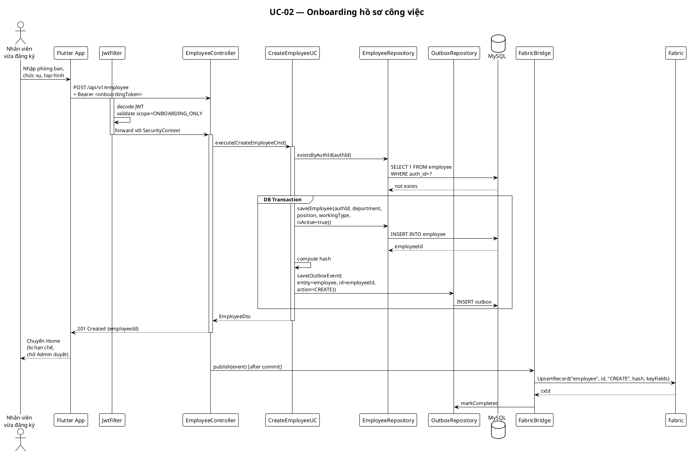
```plantuml
@startuml
!theme plain
title UC-02 — Onboarding hồ sơ công việc

actor "Nhân viên\nvừa đăng ký" as User
participant "Flutter App" as App
participant "JwtFilter" as Filter
participant "EmployeeController" as Ctrl
participant "CreateEmployeeUC" as UC
participant "EmployeeRepository" as ER
participant "OutboxRepository" as OR
database "MySQL" as DB
participant "FabricBridge" as FB
participant "Fabric" as FC

User -> App : Nhập phòng ban,\nchức vụ, loại hình
App -> Ctrl : POST /api/v1/employee\n+ Bearer <onboardingToken>
activate Filter
Filter -> Filter : decode JWT\nvalidate scope=ONBOARDING_ONLY
Filter -> Ctrl : forward với SecurityContext
deactivate Filter
activate Ctrl
Ctrl -> UC : execute(CreateEmployeeCmd)
activate UC

UC -> ER : existsByAuthId(authId)
ER -> DB : SELECT 1 FROM employee\nWHERE auth_id=?
DB --> ER : not exists

group DB Transaction
  UC -> ER : save(Employee{authId, department,\nposition, workingType,\nisActive=true})
  ER -> DB : INSERT INTO employee
  DB --> ER : employeeId
  UC -> UC : compute hash
  UC -> OR : save(OutboxEvent{\nentity=employee, id=employeeId,\naction=CREATE})
  OR -> DB : INSERT outbox
end

UC --> Ctrl : EmployeeDto
deactivate UC
Ctrl --> App : 201 Created {employeeId}
deactivate Ctrl
App --> User : Chuyển Home\n(bị hạn chế,\nchờ Admin duyệt)

Ctrl -> FB : publish(event) [after commit]
FB -> FC : UpsertRecord("employee", id, "CREATE", hash, keyFields)
FC --> FB : txId
FB -> OR : markCompleted

@enduml
```

---

#### UC-03: Đăng nhập

| Trường | Nội dung |
|---|---|
| **Mã UC** | UC-03 |
| **Tên** | Đăng nhập (Sign In) |
| **Actor chính** | Nhân viên / Manager / Chief / Admin đã có tài khoản |
| **Mục tiêu** | Xác thực và nhận JWT access token |
| **Tiền điều kiện** | Có `auth` row với `status=ACTIVE` |
| **Hậu điều kiện thành công** | Trả JWT access (15 phút) + refresh (7 ngày), `last_login` được cập nhật |
| **Luồng chính** | 1. Client gửi `{username, password}` (username có thể là email hoặc phone) 2. UseCase tìm `auth` theo username 3. Compare `BCrypt.matches(password, hash)` 4. Check `accountStatus` 5. Generate JWT chứa `{userId, role, employeeId}` 6. Generate refresh token, lưu hash vào `refresh_tokens` 7. Ghi outbox `action=LOGIN` 8. UPDATE `last_login` 9. Trả 200 OK + `{accessToken, refreshToken, role}` |
| **Luồng thay thế 2a** | User not found → 404 "Đăng nhập thất bại" (thông báo chung tránh user enumeration) |
| **Luồng thay thế 3a** | Password sai → 401 "Đăng nhập thất bại" |
| **Luồng thay thế 4a** | `status=PENDING` → 403 "Tài khoản đang chờ Admin duyệt" |
| **Luồng thay thế 4b** | `status=REJECTED` → 403 "Tài khoản đã bị từ chối" |
| **Luồng thay thế 4c** | `status=TERMINATED` → 403 "Tài khoản đã chấm dứt" |
| **Ghi blockchain** | ✅ Có — `entityType=auth`, `action=LOGIN`, `keyFields={role, loginAt, deviceInfo}` (audit trail đăng nhập) |

**Sequence Diagram UC-03:**

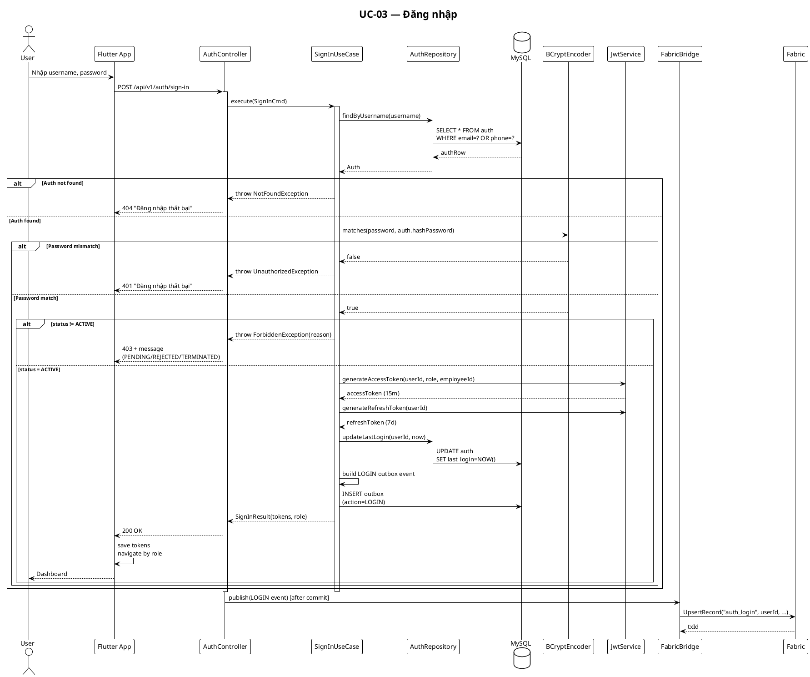
```plantuml
@startuml
!theme plain
title UC-03 — Đăng nhập

actor User
participant "Flutter App" as App
participant "AuthController" as Ctrl
participant "SignInUseCase" as UC
participant "AuthRepository" as AR
database "MySQL" as DB
participant "BCryptEncoder" as BCrypt
participant "JwtService" as JWT
participant "FabricBridge" as FB
participant "Fabric" as FC

User -> App : Nhập username, password
App -> Ctrl : POST /api/v1/auth/sign-in
activate Ctrl
Ctrl -> UC : execute(SignInCmd)
activate UC

UC -> AR : findByUsername(username)
AR -> DB : SELECT * FROM auth\nWHERE email=? OR phone=?
DB --> AR : authRow
AR --> UC : Auth

alt Auth not found
  UC --> Ctrl : throw NotFoundException
  Ctrl --> App : 404 "Đăng nhập thất bại"
else Auth found
  UC -> BCrypt : matches(password, auth.hashPassword)
  alt Password mismatch
    BCrypt --> UC : false
    UC --> Ctrl : throw UnauthorizedException
    Ctrl --> App : 401 "Đăng nhập thất bại"
  else Password match
    BCrypt --> UC : true
    alt status != ACTIVE
      UC --> Ctrl : throw ForbiddenException(reason)
      Ctrl --> App : 403 + message\n(PENDING/REJECTED/TERMINATED)
    else status = ACTIVE
      UC -> JWT : generateAccessToken(userId, role, employeeId)
      JWT --> UC : accessToken (15m)
      UC -> JWT : generateRefreshToken(userId)
      JWT --> UC : refreshToken (7d)
      UC -> AR : updateLastLogin(userId, now)
      AR -> DB : UPDATE auth\nSET last_login=NOW()
      UC -> UC : build LOGIN outbox event
      UC -> DB : INSERT outbox\n(action=LOGIN)
      UC --> Ctrl : SignInResult{tokens, role}
      Ctrl --> App : 200 OK
      App -> App : save tokens\nnavigate by role
      App --> User : Dashboard
    end
  end
end
deactivate UC
deactivate Ctrl

Ctrl -> FB : publish(LOGIN event) [after commit]
FB -> FC : UpsertRecord("auth_login", userId, ...)
FC --> FB : txId

@enduml
```

---

#### UC-04: Đăng xuất

| Trường | Nội dung |
|---|---|
| **Mã UC** | UC-04 |
| **Tên** | Đăng xuất (Sign Out) |
| **Actor chính** | Người dùng đã đăng nhập |
| **Mục tiêu** | Vô hiệu hóa refresh token, xóa token khỏi thiết bị |
| **Tiền điều kiện** | Đã đăng nhập |
| **Hậu điều kiện** | Refresh token bị revoke, device storage clean |
| **Luồng chính** | 1. Client gửi `POST /api/v1/auth/sign-out` với refresh token trong body 2. Backend tìm refresh token trong DB, đánh dấu `revoked=true` 3. Ghi outbox `action=LOGOUT` 4. Trả 204 No Content 5. Client xóa access + refresh token khỏi secure storage 6. Client chuyển về màn hình đăng nhập |
| **Ghi blockchain** | ✅ Có — ghi audit event logout để kiểm toán session |

**Sequence Diagram UC-04:**

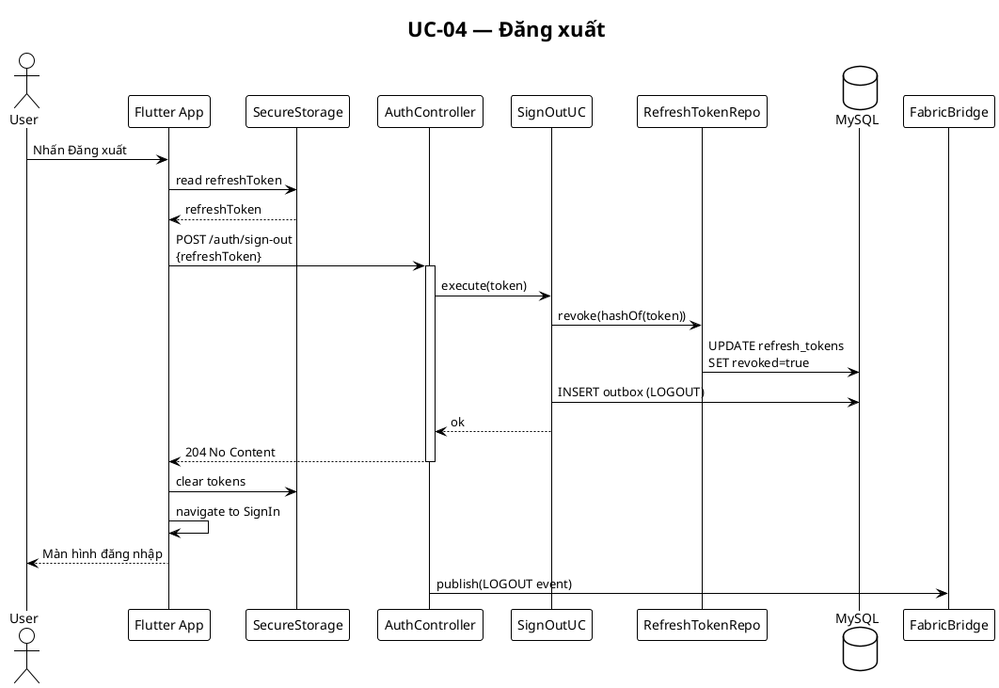
```plantuml
@startuml
!theme plain
title UC-04 — Đăng xuất

actor User
participant "Flutter App" as App
participant "SecureStorage" as SS
participant "AuthController" as Ctrl
participant "SignOutUC" as UC
participant "RefreshTokenRepo" as RTR
database "MySQL" as DB
participant "FabricBridge" as FB

User -> App : Nhấn Đăng xuất
App -> SS : read refreshToken
SS --> App : refreshToken
App -> Ctrl : POST /auth/sign-out\n{refreshToken}
activate Ctrl
Ctrl -> UC : execute(token)
UC -> RTR : revoke(hashOf(token))
RTR -> DB : UPDATE refresh_tokens\nSET revoked=true
UC -> DB : INSERT outbox (LOGOUT)
UC --> Ctrl : ok
Ctrl --> App : 204 No Content
deactivate Ctrl
App -> SS : clear tokens
App -> App : navigate to SignIn
App --> User : Màn hình đăng nhập

Ctrl -> FB : publish(LOGOUT event)

@enduml
```

---

### Nhóm B — Profile & Company Info

#### UC-05: Xem hồ sơ cá nhân

| Trường | Nội dung |
|---|---|
| **Mã UC** | UC-05 |
| **Tên** | Xem hồ sơ cá nhân |
| **Actor** | Nhân viên |
| **Mục tiêu** | Hiển thị đầy đủ thông tin `profile` của bản thân |
| **Tiền điều kiện** | Đã đăng nhập, đã có profile được tạo |
| **Hậu điều kiện** | Dữ liệu hiển thị trên UI |
| **Luồng chính** | 1. Client gửi `GET /api/v1/profile/me` 2. JwtFilter lấy `employeeId` từ token 3. UseCase load `profile` từ DB theo `employeeId` 4. Decrypt các field PII (CCCD, địa chỉ) bằng khóa DEK tương ứng 5. Trả ProfileDto đã decrypt |
| **Luồng thay thế** | Chưa có profile → 404 + gợi ý tạo profile |
| **Ghi blockchain** | ❌ Không (read-only, không cần audit ghi) |

**Sequence Diagram UC-05:**

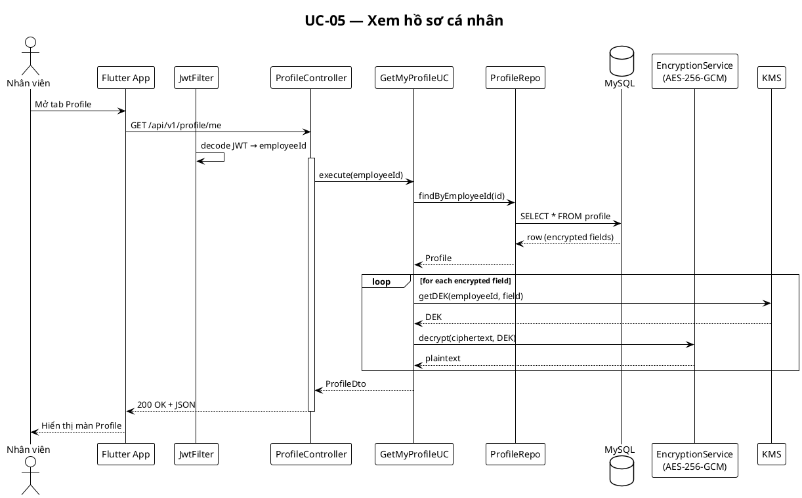
```plantuml
@startuml
!theme plain
title UC-05 — Xem hồ sơ cá nhân

actor "Nhân viên" as User
participant "Flutter App" as App
participant "JwtFilter" as F
participant "ProfileController" as Ctrl
participant "GetMyProfileUC" as UC
participant "ProfileRepo" as PR
database "MySQL" as DB
participant "EncryptionService\n(AES-256-GCM)" as Enc
participant "KMS" as KMS

User -> App : Mở tab Profile
App -> Ctrl : GET /api/v1/profile/me
F -> F : decode JWT → employeeId
activate Ctrl
Ctrl -> UC : execute(employeeId)
UC -> PR : findByEmployeeId(id)
PR -> DB : SELECT * FROM profile
DB --> PR : row (encrypted fields)
PR --> UC : Profile

loop for each encrypted field
  UC -> KMS : getDEK(employeeId, field)
  KMS --> UC : DEK
  UC -> Enc : decrypt(ciphertext, DEK)
  Enc --> UC : plaintext
end

UC --> Ctrl : ProfileDto
Ctrl --> App : 200 OK + JSON
deactivate Ctrl
App --> User : Hiển thị màn Profile

@enduml
```

---

#### UC-06: Cập nhật hồ sơ cá nhân

| Trường | Nội dung |
|---|---|
| **Mã UC** | UC-06 |
| **Tên** | Cập nhật hồ sơ cá nhân |
| **Actor** | Nhân viên |
| **Mục tiêu** | Sửa các trường profile (trừ các trường khóa do HR quản lý) |
| **Tiền điều kiện** | Đã đăng nhập |
| **Hậu điều kiện** | Profile được cập nhật, phiên bản mới được chứng thực trên blockchain |
| **Luồng chính** | 1. Client gửi `PATCH /api/v1/profile/me` với các field thay đổi 2. Validate: các trường như `identityNumber`, `name` chỉ cho phép sửa nếu chính sách cho phép 3. Load profile hiện tại 4. Merge field mới, encrypt PII 5. Canonical + hash (với dữ liệu sau update) 6. UPDATE profile + INSERT outbox (action=UPDATE) 7. Commit 8. Trả 200 OK 9. Async ghi Fabric |
| **Luồng thay thế** | Trường bị khóa → trả 403 |
| **Ghi blockchain** | ✅ Có — `action=UPDATE`, `keyFields={updatedFields: [...]}` (chỉ liệt kê tên field thay đổi, không giá trị) |

**Sequence Diagram UC-06:**

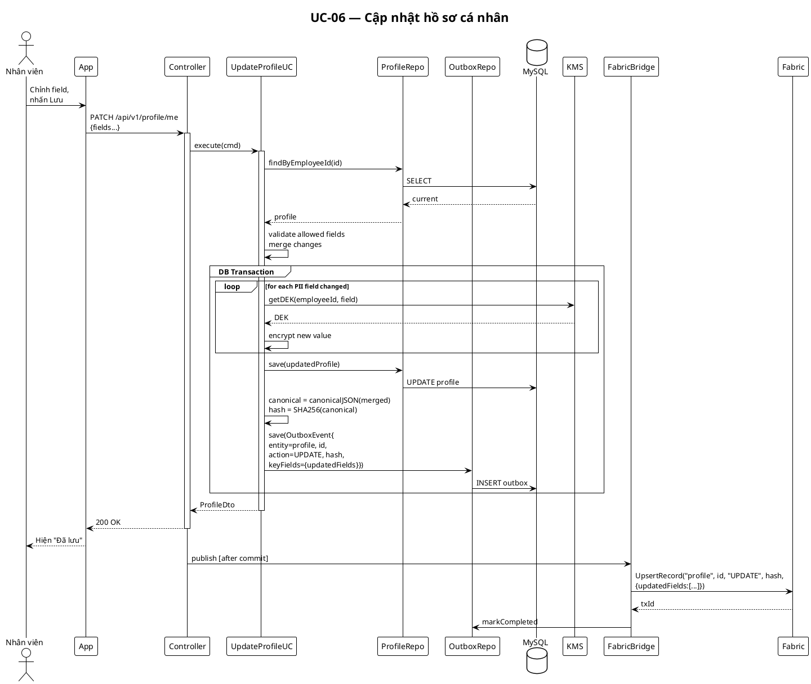
```plantuml
@startuml
!theme plain
title UC-06 — Cập nhật hồ sơ cá nhân

actor "Nhân viên" as User
participant "App" as App
participant "Controller" as Ctrl
participant "UpdateProfileUC" as UC
participant "ProfileRepo" as PR
participant "OutboxRepo" as OR
database "MySQL" as DB
participant "KMS" as KMS
participant "FabricBridge" as FB
participant "Fabric" as FC

User -> App : Chỉnh field,\nnhấn Lưu
App -> Ctrl : PATCH /api/v1/profile/me\n{fields...}
activate Ctrl
Ctrl -> UC : execute(cmd)
activate UC

UC -> PR : findByEmployeeId(id)
PR -> DB : SELECT
DB --> PR : current
PR --> UC : profile

UC -> UC : validate allowed fields\nmerge changes

group DB Transaction
  loop for each PII field changed
    UC -> KMS : getDEK(employeeId, field)
    KMS --> UC : DEK
    UC -> UC : encrypt new value
  end
  UC -> PR : save(updatedProfile)
  PR -> DB : UPDATE profile
  UC -> UC : canonical = canonicalJSON(merged)\nhash = SHA256(canonical)
  UC -> OR : save(OutboxEvent{\nentity=profile, id,\naction=UPDATE, hash,\nkeyFields={updatedFields}})
  OR -> DB : INSERT outbox
end

UC --> Ctrl : ProfileDto
deactivate UC
Ctrl --> App : 200 OK
deactivate Ctrl
App --> User : Hiện "Đã lưu"

Ctrl -> FB : publish [after commit]
FB -> FC : UpsertRecord("profile", id, "UPDATE", hash,\n{updatedFields:[...]})
FC --> FB : txId
FB -> OR : markCompleted

@enduml
```

---

#### UC-07: Xem thông tin công ty

| Trường | Nội dung |
|---|---|
| **Mã UC** | UC-07 |
| **Tên** | Xem thông tin công ty |
| **Actor** | Mọi vai trò đã đăng nhập |
| **Mục tiêu** | Hiển thị thông tin công ty (tên, MST, địa chỉ, đại diện) |
| **Tiền điều kiện** | Đã đăng nhập |
| **Luồng chính** | 1. `GET /api/v1/company` 2. Load `company` từ DB 3. Trả CompanyDto |
| **Ghi blockchain** | ❌ Không |

**Sequence Diagram UC-07:**

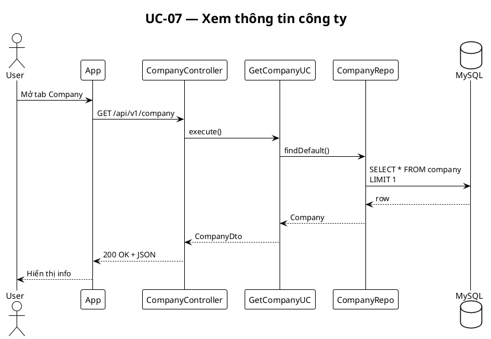
```plantuml
@startuml
!theme plain
title UC-07 — Xem thông tin công ty

actor User
participant "App" as App
participant "CompanyController" as Ctrl
participant "GetCompanyUC" as UC
participant "CompanyRepo" as CR
database "MySQL" as DB

User -> App : Mở tab Company
App -> Ctrl : GET /api/v1/company
Ctrl -> UC : execute()
UC -> CR : findDefault()
CR -> DB : SELECT * FROM company\nLIMIT 1
DB --> CR : row
CR --> UC : Company
UC --> Ctrl : CompanyDto
Ctrl --> App : 200 OK + JSON
App --> User : Hiển thị info

@enduml
```

---

### Nhóm C — Contract & Payroll

#### UC-08: Xem hợp đồng

| Trường | Nội dung |
|---|---|
| **Mã UC** | UC-08 |
| **Tên** | Xem hợp đồng lao động |
| **Actor** | Nhân viên (xem của chính mình); Chief/Admin (xem của bất kỳ nhân viên nào) |
| **Mục tiêu** | Hiển thị hợp đồng hiện hành |
| **Tiền điều kiện** | Đã đăng nhập, có hợp đồng trong DB |
| **Luồng chính** | 1. `GET /api/v1/contract/me` (Employee) hoặc `GET /api/v1/contract/{employeeId}` (Chief/Admin) 2. Controller kiểm tra quyền — Employee chỉ được xem của mình 3. Load contract, decrypt các field nhạy cảm nếu có (tax_code, BHXH) 4. Trả ContractDto kèm metadata verify (dataHash từ outbox mới nhất) |
| **Luồng thay thế** | Employee xem hợp đồng của người khác → 403 |
| **Ghi blockchain** | ❌ Không (read); nhưng UI có nút "Xác minh trên blockchain" (→ UC-25) |

**Sequence Diagram UC-08:**

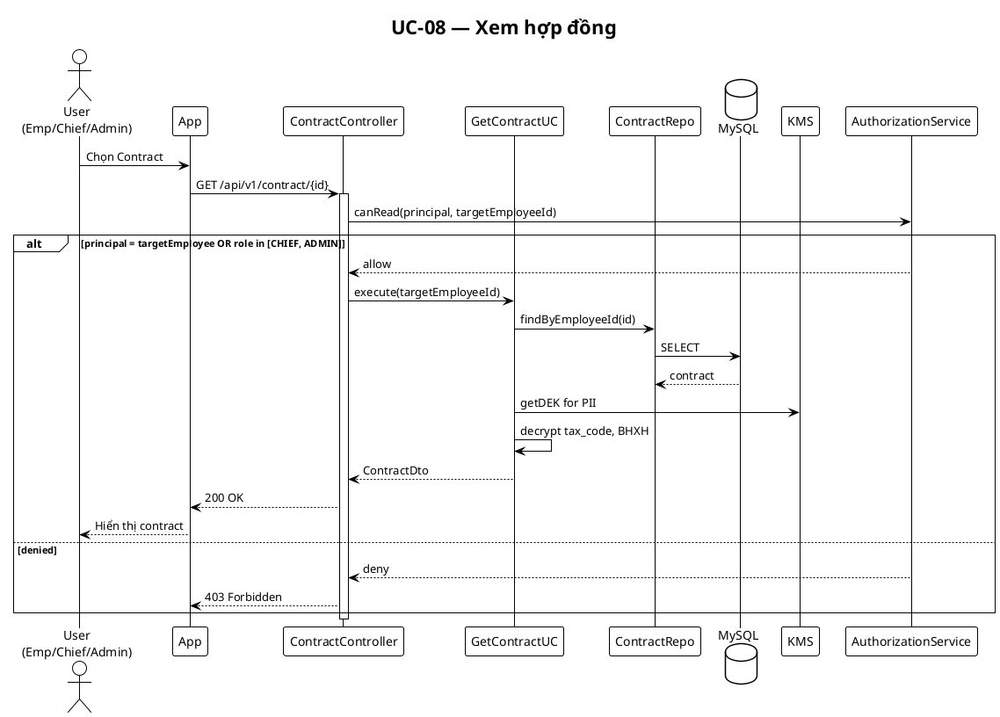
```plantuml
@startuml
!theme plain
title UC-08 — Xem hợp đồng

actor "User\n(Emp/Chief/Admin)" as User
participant "App" as App
participant "ContractController" as Ctrl
participant "GetContractUC" as UC
participant "ContractRepo" as CR
database "MySQL" as DB
participant "KMS" as KMS
participant "AuthorizationService" as Auth

User -> App : Chọn Contract
App -> Ctrl : GET /api/v1/contract/{id}
activate Ctrl
Ctrl -> Auth : canRead(principal, targetEmployeeId)
alt principal = targetEmployee OR role in [CHIEF, ADMIN]
  Auth --> Ctrl : allow
  Ctrl -> UC : execute(targetEmployeeId)
  UC -> CR : findByEmployeeId(id)
  CR -> DB : SELECT
  DB --> CR : contract
  UC -> KMS : getDEK for PII
  UC -> UC : decrypt tax_code, BHXH
  UC --> Ctrl : ContractDto
  Ctrl --> App : 200 OK
  App --> User : Hiển thị contract
else denied
  Auth --> Ctrl : deny
  Ctrl --> App : 403 Forbidden
end
deactivate Ctrl

@enduml
```

---

#### UC-09: Xem bảng lương

| Trường | Nội dung |
|---|---|
| **Mã UC** | UC-09 |
| **Tên** | Xem bảng lương |
| **Actor** | Nhân viên (của mình); Chief/Admin (của mọi người) |
| **Mục tiêu** | Hiển thị payroll theo kỳ (tháng) |
| **Tiền điều kiện** | Đã đăng nhập |
| **Luồng chính** | 1. `GET /api/v1/payroll/me?period=YYYY-MM` 2. Check quyền 3. Load payroll, decrypt (gross, deductions, net, bank_account) 4. Trả PayrollDto |
| **Ghi blockchain** | ❌ Không (read) |

**Sequence Diagram UC-09:**

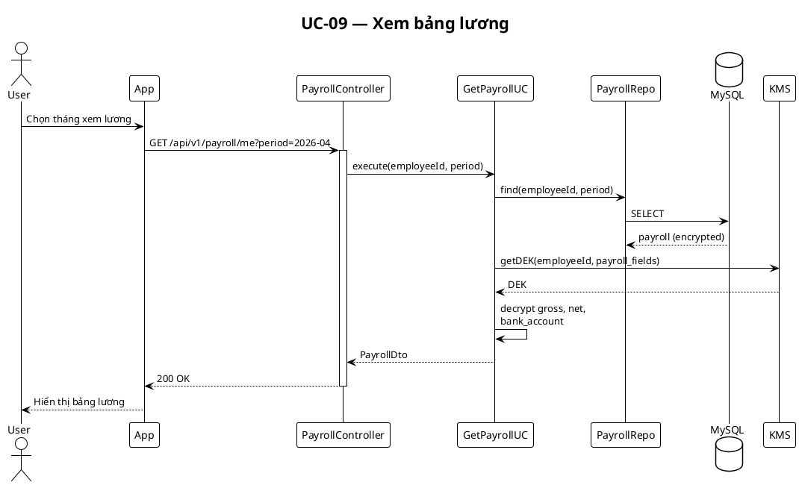
```plantuml
@startuml
!theme plain
title UC-09 — Xem bảng lương

actor User
participant "App" as App
participant "PayrollController" as Ctrl
participant "GetPayrollUC" as UC
participant "PayrollRepo" as PR
database "MySQL" as DB
participant "KMS" as KMS

User -> App : Chọn tháng xem lương
App -> Ctrl : GET /api/v1/payroll/me?period=2026-04
activate Ctrl
Ctrl -> UC : execute(employeeId, period)
UC -> PR : find(employeeId, period)
PR -> DB : SELECT
DB --> PR : payroll (encrypted)
UC -> KMS : getDEK(employeeId, payroll_fields)
KMS --> UC : DEK
UC -> UC : decrypt gross, net,\nbank_account
UC --> Ctrl : PayrollDto
Ctrl --> App : 200 OK
deactivate Ctrl
App --> User : Hiển thị bảng lương

@enduml
```

---

### Nhóm D — Attendance

#### UC-10: Check-in chấm công

| Trường | Nội dung |
|---|---|
| **Mã UC** | UC-10 |
| **Tên** | Check-in chấm công buổi sáng |
| **Actor** | Nhân viên |
| **Mục tiêu** | Ghi nhận giờ vào làm kèm vị trí GPS |
| **Tiền điều kiện** | Đã đăng nhập, chưa check-in hôm nay |
| **Hậu điều kiện** | Row `attendance` có `check_in_time`, hash ghi lên Fabric |
| **Luồng chính** | 1. App xin quyền vị trí, lấy GPS 2. Gửi `POST /api/v1/attendance/check-in` với `{location, note}` 3. Validate: chưa có `attendance` cho `(employeeId, today)` 4. (Tùy chọn) Validate geofence — khoảng cách đến văn phòng ≤ bán kính cho phép 5. Tính `status` dựa trên giờ: PRESENT (< 8:30) / LATE (8:30–10:00) / HALF_DAY (> 10:00) 6. INSERT `attendance` + INSERT outbox 7. Commit, trả 201 Created 8. Async ghi Fabric |
| **Luồng thay thế 3a** | Đã check-in → 409 "Bạn đã check-in hôm nay" |
| **Luồng thay thế 4a** | Ngoài geofence → tùy policy: cảnh báo hoặc từ chối |
| **Ghi blockchain** | ✅ Có — `action=CHECK_IN`, `keyFields={date, checkInTime, geoHash, status}` (không lưu tọa độ chính xác) |

**Sequence Diagram UC-10:**

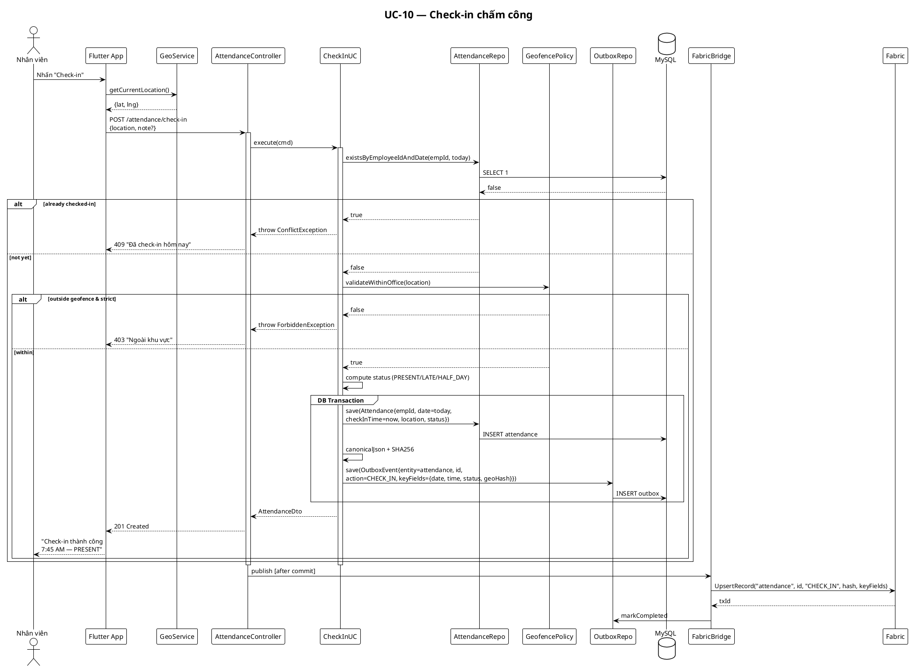
```plantuml
@startuml
!theme plain
title UC-10 — Check-in chấm công

actor "Nhân viên" as User
participant "Flutter App" as App
participant "GeoService" as Geo
participant "AttendanceController" as Ctrl
participant "CheckInUC" as UC
participant "AttendanceRepo" as AR
participant "GeofencePolicy" as GF
participant "OutboxRepo" as OR
database "MySQL" as DB
participant "FabricBridge" as FB
participant "Fabric" as FC

User -> App : Nhấn "Check-in"
App -> Geo : getCurrentLocation()
Geo --> App : {lat, lng}
App -> Ctrl : POST /attendance/check-in\n{location, note?}
activate Ctrl
Ctrl -> UC : execute(cmd)
activate UC

UC -> AR : existsByEmployeeIdAndDate(empId, today)
AR -> DB : SELECT 1
DB --> AR : false
alt already checked-in
  AR --> UC : true
  UC --> Ctrl : throw ConflictException
  Ctrl --> App : 409 "Đã check-in hôm nay"
else not yet
  AR --> UC : false
  UC -> GF : validateWithinOffice(location)
  alt outside geofence & strict
    GF --> UC : false
    UC --> Ctrl : throw ForbiddenException
    Ctrl --> App : 403 "Ngoài khu vực"
  else within
    GF --> UC : true
    UC -> UC : compute status (PRESENT/LATE/HALF_DAY)

    group DB Transaction
      UC -> AR : save(Attendance{empId, date=today,\ncheckInTime=now, location, status})
      AR -> DB : INSERT attendance
      UC -> UC : canonicalJson + SHA256
      UC -> OR : save(OutboxEvent{entity=attendance, id,\naction=CHECK_IN, keyFields={date, time, status, geoHash}})
      OR -> DB : INSERT outbox
    end

    UC --> Ctrl : AttendanceDto
    Ctrl --> App : 201 Created
    App --> User : "Check-in thành công\n7:45 AM — PRESENT"
  end
end
deactivate UC
deactivate Ctrl

Ctrl -> FB : publish [after commit]
FB -> FC : UpsertRecord("attendance", id, "CHECK_IN", hash, keyFields)
FC --> FB : txId
FB -> OR : markCompleted

@enduml
```

---

#### UC-11: Check-out chấm công

| Trường | Nội dung |
|---|---|
| **Mã UC** | UC-11 |
| **Tên** | Check-out chấm công cuối ngày |
| **Actor** | Nhân viên |
| **Mục tiêu** | Ghi nhận giờ về và tính tổng giờ làm việc |
| **Tiền điều kiện** | Đã check-in hôm nay, chưa check-out |
| **Luồng chính** | 1. App lấy GPS → gọi `POST /api/v1/attendance/check-out` 2. Load attendance của hôm nay 3. Cập nhật `check_out_time`, tính `total_hours = (checkOut - checkIn) / 3600` 4. Nếu `total_hours < 4h` → đánh dấu `HALF_DAY` 5. INSERT outbox (`action=CHECK_OUT`) 6. Commit |
| **Luồng thay thế** | Chưa check-in → 409 "Chưa check-in" |
| **Ghi blockchain** | ✅ Có — `action=CHECK_OUT`, `keyFields={date, checkOutTime, totalHours, status}` |

**Sequence Diagram UC-11:**

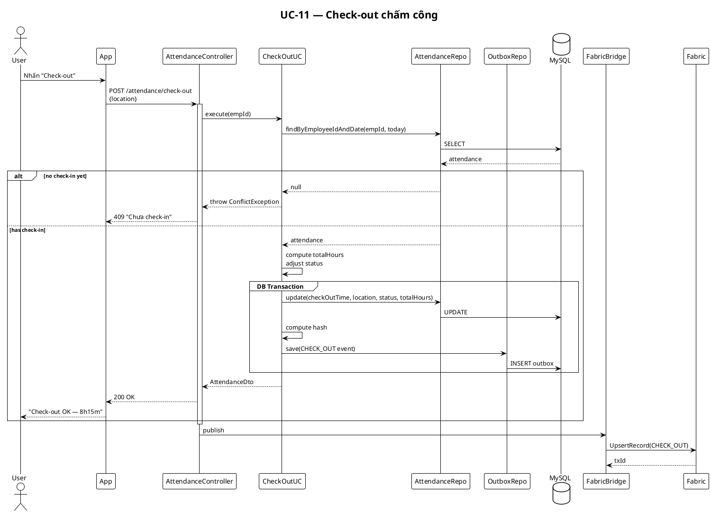
```plantuml
@startuml
!theme plain
title UC-11 — Check-out chấm công

actor User
participant "App" as App
participant "AttendanceController" as Ctrl
participant "CheckOutUC" as UC
participant "AttendanceRepo" as AR
participant "OutboxRepo" as OR
database "MySQL" as DB
participant "FabricBridge" as FB
participant "Fabric" as FC

User -> App : Nhấn "Check-out"
App -> Ctrl : POST /attendance/check-out\n{location}
activate Ctrl
Ctrl -> UC : execute(empId)
UC -> AR : findByEmployeeIdAndDate(empId, today)
AR -> DB : SELECT
DB --> AR : attendance
alt no check-in yet
  AR --> UC : null
  UC --> Ctrl : throw ConflictException
  Ctrl --> App : 409 "Chưa check-in"
else has check-in
  AR --> UC : attendance
  UC -> UC : compute totalHours\nadjust status

  group DB Transaction
    UC -> AR : update(checkOutTime, location, status, totalHours)
    AR -> DB : UPDATE
    UC -> UC : compute hash
    UC -> OR : save(CHECK_OUT event)
    OR -> DB : INSERT outbox
  end

  UC --> Ctrl : AttendanceDto
  Ctrl --> App : 200 OK
  App --> User : "Check-out OK — 8h15m"
end
deactivate Ctrl

Ctrl -> FB : publish
FB -> FC : UpsertRecord(CHECK_OUT)
FC --> FB : txId

@enduml
```

---

#### UC-12: Xem lịch sử chấm công

| Trường | Nội dung |
|---|---|
| **Mã UC** | UC-12 |
| **Tên** | Xem lịch sử chấm công |
| **Actor** | Nhân viên (của mình); Manager (cấp dưới); Chief/Admin (mọi người) |
| **Mục tiêu** | Liệt kê các bản ghi attendance theo tháng/tuần |
| **Luồng chính** | 1. `GET /api/v1/attendance?from=...&to=...&employeeId=...` 2. Kiểm tra quyền xem 3. Query DB theo range 4. Trả list + aggregated stats (tổng giờ, số ngày PRESENT/LATE) |
| **Ghi blockchain** | ❌ Không |

**Sequence Diagram UC-12:**

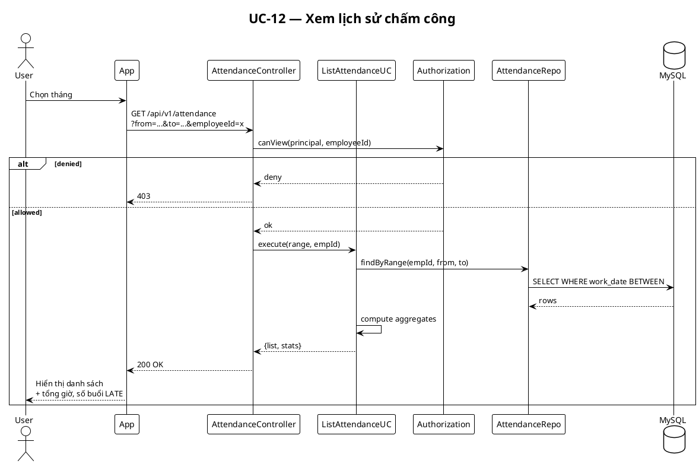
```plantuml
@startuml
!theme plain
title UC-12 — Xem lịch sử chấm công

actor User
participant "App" as App
participant "AttendanceController" as Ctrl
participant "ListAttendanceUC" as UC
participant "Authorization" as Auth
participant "AttendanceRepo" as AR
database "MySQL" as DB

User -> App : Chọn tháng
App -> Ctrl : GET /api/v1/attendance\n?from=...&to=...&employeeId=x
Ctrl -> Auth : canView(principal, employeeId)
alt denied
  Auth --> Ctrl : deny
  Ctrl --> App : 403
else allowed
  Auth --> Ctrl : ok
  Ctrl -> UC : execute(range, empId)
  UC -> AR : findByRange(empId, from, to)
  AR -> DB : SELECT WHERE work_date BETWEEN
  DB --> AR : rows
  UC -> UC : compute aggregates
  UC --> Ctrl : {list, stats}
  Ctrl --> App : 200 OK
  App --> User : Hiển thị danh sách\n+ tổng giờ, số buổi LATE
end

@enduml
```

---

### Nhóm E — Request Management

#### UC-13: Tạo đơn nghỉ phép

| Trường | Nội dung |
|---|---|
| **Mã UC** | UC-13 |
| **Tên** | Tạo đơn nghỉ phép |
| **Actor** | Nhân viên |
| **Mục tiêu** | Gửi đơn xin nghỉ phép đến Manager |
| **Tiền điều kiện** | Đã đăng nhập; `requestType=LEAVE`; `startDate ≥ today` |
| **Hậu điều kiện** | Row `leave_request` được tạo với `status=PENDING`, hash ghi lên Fabric cố định nội dung đơn |
| **Luồng chính** | 1. Client gửi `POST /api/v1/requests` với `{requestType=LEAVE, startDate, endDate, session, reason, photoUrl?}` 2. Validate: `endDate ≥ startDate`, `reason ≥ 10 ký tự` 3. (Tùy chọn) Check quota phép còn lại 4. INSERT `leave_request`, status=PENDING 5. INSERT outbox (action=CREATE_REQUEST) 6. Commit 7. Async ghi Fabric + gửi notification cho Manager |
| **Luồng thay thế 2a** | Validate fail → 400 |
| **Luồng thay thế 3a** | Hết quota → 422 "Đã dùng hết số ngày phép" |
| **Ghi blockchain** | ✅ Có — `action=CREATE`, `keyFields={requestType, startDate, endDate, session, reasonHash}` (reasonHash thay vì reason để tránh lộ) |

**Sequence Diagram UC-13:**

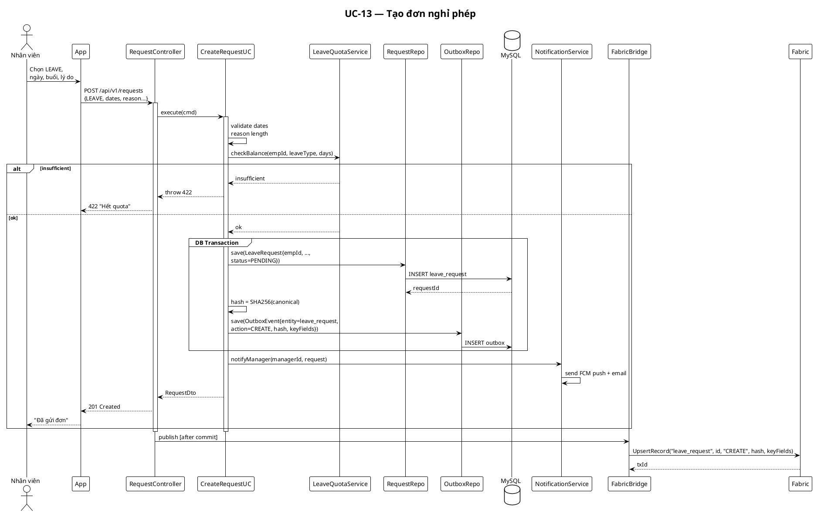
```plantuml
@startuml
!theme plain
title UC-13 — Tạo đơn nghỉ phép

actor "Nhân viên" as User
participant "App" as App
participant "RequestController" as Ctrl
participant "CreateRequestUC" as UC
participant "LeaveQuotaService" as Quota
participant "RequestRepo" as RR
participant "OutboxRepo" as OR
database "MySQL" as DB
participant "NotificationService" as Notif
participant "FabricBridge" as FB
participant "Fabric" as FC

User -> App : Chọn LEAVE,\nngày, buổi, lý do
App -> Ctrl : POST /api/v1/requests\n{LEAVE, dates, reason...}
activate Ctrl
Ctrl -> UC : execute(cmd)
activate UC

UC -> UC : validate dates\nreason length

UC -> Quota : checkBalance(empId, leaveType, days)
alt insufficient
  Quota --> UC : insufficient
  UC --> Ctrl : throw 422
  Ctrl --> App : 422 "Hết quota"
else ok
  Quota --> UC : ok

  group DB Transaction
    UC -> RR : save(LeaveRequest{empId, ...,\nstatus=PENDING})
    RR -> DB : INSERT leave_request
    DB --> RR : requestId
    UC -> UC : hash = SHA256(canonical)
    UC -> OR : save(OutboxEvent{entity=leave_request,\naction=CREATE, hash, keyFields})
    OR -> DB : INSERT outbox
  end

  UC -> Notif : notifyManager(managerId, request)
  Notif -> Notif : send FCM push + email
  UC --> Ctrl : RequestDto
  Ctrl --> App : 201 Created
  App --> User : "Đã gửi đơn"
end
deactivate UC
deactivate Ctrl

Ctrl -> FB : publish [after commit]
FB -> FC : UpsertRecord("leave_request", id, "CREATE", hash, keyFields)
FC --> FB : txId

@enduml
```

---

#### UC-14: Xem danh sách đơn của bản thân

| Trường | Nội dung |
|---|---|
| **Mã UC** | UC-14 |
| **Tên** | Xem danh sách đơn của bản thân |
| **Actor** | Nhân viên |
| **Mục tiêu** | Liệt kê các đơn đã gửi theo trạng thái |
| **Luồng chính** | 1. `GET /api/v1/requests/me?status=...&page=...` 2. Query DB theo `employeeId` 3. Trả paginated list |
| **Ghi blockchain** | ❌ Không |

**Sequence Diagram UC-14:**

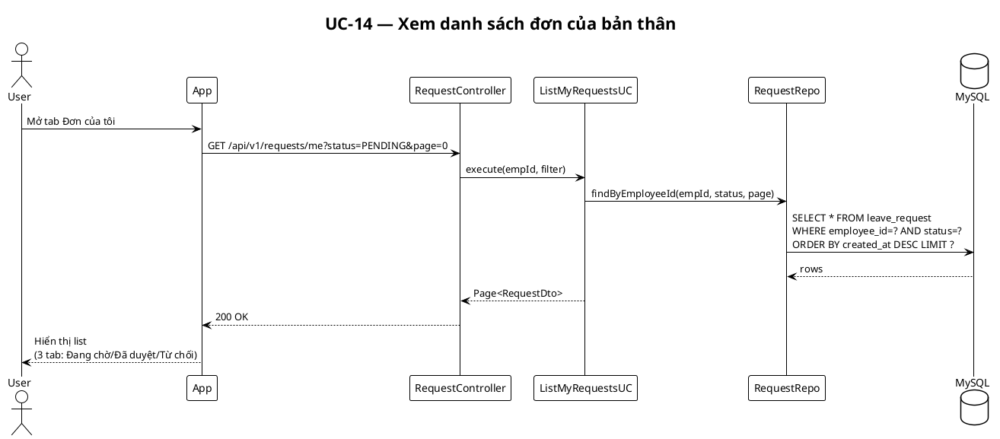
```plantuml
@startuml
!theme plain
title UC-14 — Xem danh sách đơn của bản thân

actor User
participant App
participant "RequestController" as Ctrl
participant "ListMyRequestsUC" as UC
participant "RequestRepo" as RR
database "MySQL" as DB

User -> App : Mở tab Đơn của tôi
App -> Ctrl : GET /api/v1/requests/me?status=PENDING&page=0
Ctrl -> UC : execute(empId, filter)
UC -> RR : findByEmployeeId(empId, status, page)
RR -> DB : SELECT * FROM leave_request\nWHERE employee_id=? AND status=?\nORDER BY created_at DESC LIMIT ?
DB --> RR : rows
UC --> Ctrl : Page<RequestDto>
Ctrl --> App : 200 OK
App --> User : Hiển thị list\n(3 tab: Đang chờ/Đã duyệt/Từ chối)

@enduml
```

---

#### UC-15: Hủy đơn của bản thân

| Trường | Nội dung |
|---|---|
| **Mã UC** | UC-15 |
| **Tên** | Hủy đơn đã gửi (khi còn PENDING) |
| **Actor** | Nhân viên (người tạo đơn) |
| **Mục tiêu** | Rút lại đơn trước khi Manager duyệt |
| **Tiền điều kiện** | Đơn thuộc sở hữu; `status=PENDING` |
| **Luồng chính** | 1. `PATCH /api/v1/requests/{id}/cancel` 2. Check ownership 3. Check status=PENDING 4. UPDATE status=CANCELLED 5. Ghi outbox `action=CANCEL` |
| **Luồng thay thế** | Đơn đã APPROVED/REJECTED → 409 "Không thể hủy" |
| **Ghi blockchain** | ✅ Có — `action=CANCEL`, `keyFields={cancelledAt, cancelledBy}` |

**Sequence Diagram UC-15:**

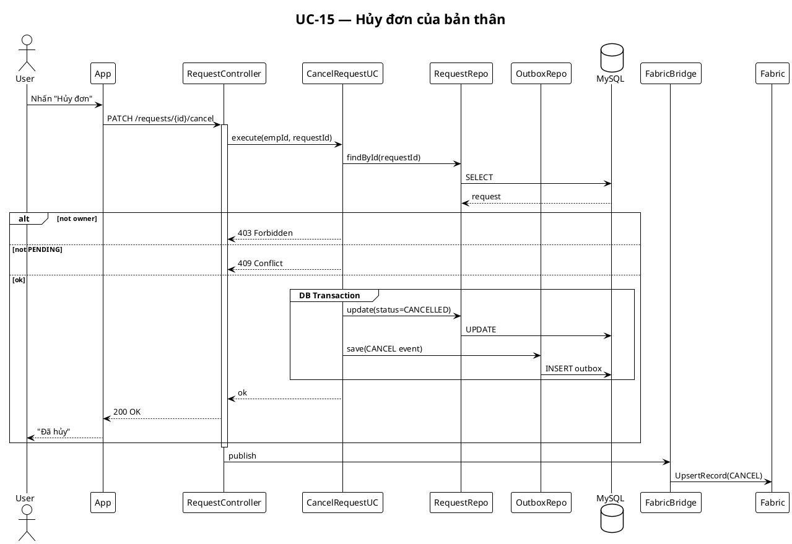
```plantuml
@startuml
!theme plain
title UC-15 — Hủy đơn của bản thân

actor User
participant App
participant "RequestController" as Ctrl
participant "CancelRequestUC" as UC
participant "RequestRepo" as RR
participant "OutboxRepo" as OR
database "MySQL" as DB
participant "FabricBridge" as FB
participant "Fabric" as FC

User -> App : Nhấn "Hủy đơn"
App -> Ctrl : PATCH /requests/{id}/cancel
activate Ctrl
Ctrl -> UC : execute(empId, requestId)
UC -> RR : findById(requestId)
RR -> DB : SELECT
DB --> RR : request
alt not owner
  UC --> Ctrl : 403 Forbidden
else not PENDING
  UC --> Ctrl : 409 Conflict
else ok
  group DB Transaction
    UC -> RR : update(status=CANCELLED)
    RR -> DB : UPDATE
    UC -> OR : save(CANCEL event)
    OR -> DB : INSERT outbox
  end
  UC --> Ctrl : ok
  Ctrl --> App : 200 OK
  App --> User : "Đã hủy"
end
deactivate Ctrl

Ctrl -> FB : publish
FB -> FC : UpsertRecord(CANCEL)

@enduml
```

---

### Nhóm F — Directory (Danh bạ)

#### UC-16: Xem danh bạ nhân viên

| Trường | Nội dung |
|---|---|
| **Mã UC** | UC-16 |
| **Tên** | Xem danh bạ nhân viên công ty |
| **Actor** | Mọi vai trò |
| **Mục tiêu** | Tìm liên hệ đồng nghiệp |
| **Luồng chính** | 1. `GET /api/v1/directory?query=&department=&page=` 2. Query với projection chỉ lấy các field public: `fullName, position, department, email, phone, avatar` 3. Trả list |
| **Ghi chú bảo mật** | Không trả CCCD, lương, địa chỉ nhà. Employee chỉ thấy mức thông tin contact cơ bản. |
| **Ghi blockchain** | ❌ Không |

**Sequence Diagram UC-16:**

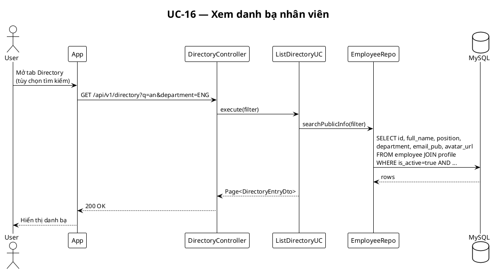
```plantuml
@startuml
!theme plain
title UC-16 — Xem danh bạ nhân viên

actor User
participant App
participant "DirectoryController" as Ctrl
participant "ListDirectoryUC" as UC
participant "EmployeeRepo" as ER
database "MySQL" as DB

User -> App : Mở tab Directory\n(tùy chọn tìm kiếm)
App -> Ctrl : GET /api/v1/directory?q=an&department=ENG
Ctrl -> UC : execute(filter)
UC -> ER : searchPublicInfo(filter)
ER -> DB : SELECT id, full_name, position,\ndepartment, email_pub, avatar_url\nFROM employee JOIN profile\nWHERE is_active=true AND ...
DB --> ER : rows
UC --> Ctrl : Page<DirectoryEntryDto>
Ctrl --> App : 200 OK
App --> User : Hiển thị danh bạ

@enduml
```

---

### Nhóm G — Manager Functions

#### UC-17: Xem danh sách đơn của cấp dưới

| Trường | Nội dung |
|---|---|
| **Mã UC** | UC-17 |
| **Tên** | Manager xem đơn của cấp dưới |
| **Actor** | Manager (hoặc Chief) |
| **Mục tiêu** | Xem các đơn cần duyệt |
| **Tiền điều kiện** | `role ∈ {MANAGER, CHIEF, ADMIN}` |
| **Luồng chính** | 1. `GET /api/v1/manager/requests?status=PENDING` 2. Tìm các `employee` có `manager_id = currentUser.employeeId` 3. Query leave_request của các employee đó 4. Trả paginated list |
| **Ghi blockchain** | ❌ Không |

**Sequence Diagram UC-17:**

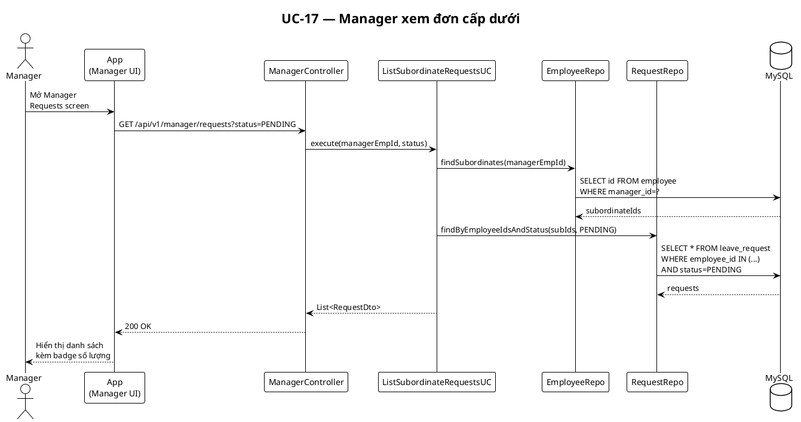
```plantuml
@startuml
!theme plain
title UC-17 — Manager xem đơn cấp dưới

actor Manager
participant "App\n(Manager UI)" as App
participant "ManagerController" as Ctrl
participant "ListSubordinateRequestsUC" as UC
participant "EmployeeRepo" as ER
participant "RequestRepo" as RR
database "MySQL" as DB

Manager -> App : Mở Manager\nRequests screen
App -> Ctrl : GET /api/v1/manager/requests?status=PENDING
Ctrl -> UC : execute(managerEmpId, status)
UC -> ER : findSubordinates(managerEmpId)
ER -> DB : SELECT id FROM employee\nWHERE manager_id=?
DB --> ER : subordinateIds
UC -> RR : findByEmployeeIdsAndStatus(subIds, PENDING)
RR -> DB : SELECT * FROM leave_request\nWHERE employee_id IN (...)\nAND status=PENDING
DB --> RR : requests
UC --> Ctrl : List<RequestDto>
Ctrl --> App : 200 OK
App --> Manager : Hiển thị danh sách\nkèm badge số lượng

@enduml
```

---

#### UC-18: Duyệt đơn cấp dưới

| Trường | Nội dung |
|---|---|
| **Mã UC** | UC-18 |
| **Tên** | Manager duyệt đơn |
| **Actor** | Manager |
| **Mục tiêu** | Chuyển trạng thái đơn `PENDING → APPROVED` |
| **Tiền điều kiện** | Đơn thuộc cấp dưới; đơn đang PENDING |
| **Hậu điều kiện** | Đơn APPROVED, `approver_id`, `approved_at` được set; hash ghi Fabric; nhân viên nhận notification |
| **Luồng chính** | 1. `PATCH /api/v1/manager/requests/{id}/approve` 2. Load request 3. Validate: manager là cấp trên của người tạo đơn; status=PENDING 4. UPDATE: status=APPROVED, approver_id, approved_at 5. Nếu là LEAVE → trừ quota nghỉ phép 6. INSERT outbox (action=APPROVE) 7. Commit 8. Notify employee + async Fabric |
| **Luồng thay thế** | Không phải cấp trên → 403; đơn đã xử lý → 409 |
| **Ghi blockchain** | ✅ Có — `action=APPROVE`, `keyFields={approverId, approvedAt, requestType}` |

**Sequence Diagram UC-18:**

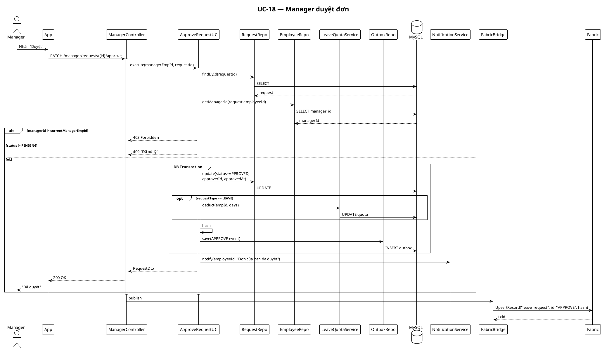
```plantuml
@startuml
!theme plain
title UC-18 — Manager duyệt đơn

actor Manager
participant App
participant "ManagerController" as Ctrl
participant "ApproveRequestUC" as UC
participant "RequestRepo" as RR
participant "EmployeeRepo" as ER
participant "LeaveQuotaService" as Quota
participant "OutboxRepo" as OR
database "MySQL" as DB
participant "NotificationService" as Notif
participant "FabricBridge" as FB
participant "Fabric" as FC

Manager -> App : Nhấn "Duyệt"
App -> Ctrl : PATCH /manager/requests/{id}/approve
activate Ctrl
Ctrl -> UC : execute(managerEmpId, requestId)
activate UC

UC -> RR : findById(requestId)
RR -> DB : SELECT
DB --> RR : request

UC -> ER : getManagerId(request.employeeId)
ER -> DB : SELECT manager_id
DB --> ER : managerId
alt managerId != currentManagerEmpId
  UC --> Ctrl : 403 Forbidden
else status != PENDING
  UC --> Ctrl : 409 "Đã xử lý"
else ok
  group DB Transaction
    UC -> RR : update(status=APPROVED,\napproverId, approvedAt)
    RR -> DB : UPDATE
    opt requestType == LEAVE
      UC -> Quota : deduct(empId, days)
      Quota -> DB : UPDATE quota
    end
    UC -> UC : hash
    UC -> OR : save(APPROVE event)
    OR -> DB : INSERT outbox
  end

  UC -> Notif : notify(employeeId, "Đơn của bạn đã duyệt")
  UC --> Ctrl : RequestDto
  Ctrl --> App : 200 OK
  App --> Manager : "Đã duyệt"
end
deactivate UC
deactivate Ctrl

Ctrl -> FB : publish
FB -> FC : UpsertRecord("leave_request", id, "APPROVE", hash)
FC --> FB : txId

@enduml
```

---

#### UC-19: Từ chối đơn cấp dưới

| Trường | Nội dung |
|---|---|
| **Mã UC** | UC-19 |
| **Tên** | Manager từ chối đơn |
| **Actor** | Manager |
| **Mục tiêu** | Chuyển trạng thái đơn `PENDING → REJECTED` |
| **Tiền điều kiện** | Đơn thuộc cấp dưới; status=PENDING; phải nhập lý do |
| **Luồng chính** | 1. `PATCH /manager/requests/{id}/reject` với `{reason}` 2. Validate `reason.length ≥ 10` 3. Check quyền 4. UPDATE: status=REJECTED, rejected_reason, approver_id, approved_at 5. INSERT outbox `action=REJECT` 6. Notify employee |
| **Ghi blockchain** | ✅ Có — `action=REJECT`, `keyFields={rejectedBy, rejectedAt, reasonHash}` |

**Sequence Diagram UC-19:**

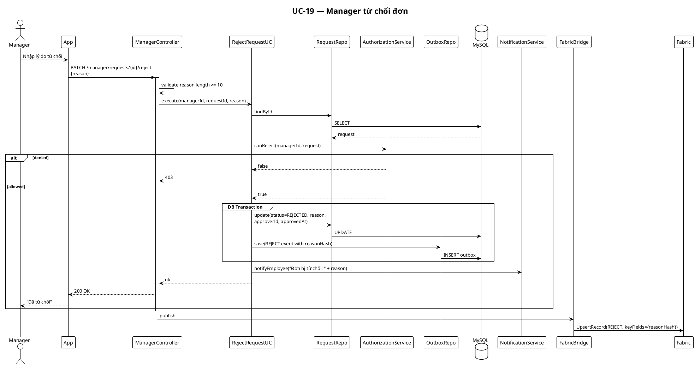
```plantuml
@startuml
!theme plain
title UC-19 — Manager từ chối đơn

actor Manager
participant App
participant "ManagerController" as Ctrl
participant "RejectRequestUC" as UC
participant "RequestRepo" as RR
participant "AuthorizationService" as Auth
participant "OutboxRepo" as OR
database "MySQL" as DB
participant "NotificationService" as Notif
participant "FabricBridge" as FB
participant "Fabric" as FC

Manager -> App : Nhập lý do từ chối
App -> Ctrl : PATCH /manager/requests/{id}/reject\n{reason}
activate Ctrl
Ctrl -> Ctrl : validate reason length >= 10
Ctrl -> UC : execute(managerId, requestId, reason)
UC -> RR : findById
RR -> DB : SELECT
DB --> RR : request
UC -> Auth : canReject(managerId, request)
alt denied
  Auth --> UC : false
  UC --> Ctrl : 403
else allowed
  Auth --> UC : true
  group DB Transaction
    UC -> RR : update(status=REJECTED, reason,\napproverId, approvedAt)
    RR -> DB : UPDATE
    UC -> OR : save(REJECT event with reasonHash)
    OR -> DB : INSERT outbox
  end
  UC -> Notif : notifyEmployee("Đơn bị từ chối: " + reason)
  UC --> Ctrl : ok
  Ctrl --> App : 200 OK
  App --> Manager : "Đã từ chối"
end
deactivate Ctrl

Ctrl -> FB : publish
FB -> FC : UpsertRecord(REJECT, keyFields={reasonHash})

@enduml
```

---

### Nhóm H — Chief Functions

#### UC-20: Xem toàn bộ nhân viên

| Trường | Nội dung |
|---|---|
| **Mã UC** | UC-20 |
| **Tên** | Chief/Admin xem toàn bộ nhân viên |
| **Actor** | Chief, Admin |
| **Mục tiêu** | Xem danh sách đầy đủ với filter |
| **Luồng chính** | 1. `GET /api/v1/chief/employees?department=&status=&page=` 2. Query với projection đầy đủ (khác với directory vì có thể xem `isActive=false` và managementInfo) 3. Trả list |
| **Ghi blockchain** | ❌ Không |

**Sequence Diagram UC-20:**

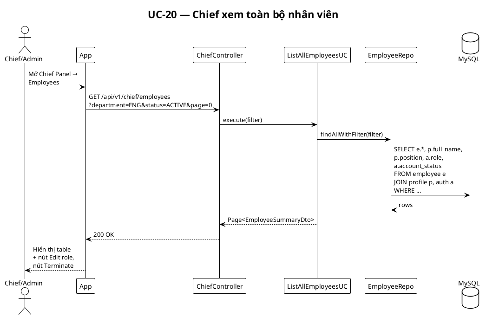
```plantuml
@startuml
!theme plain
title UC-20 — Chief xem toàn bộ nhân viên

actor "Chief/Admin" as Chief
participant App
participant "ChiefController" as Ctrl
participant "ListAllEmployeesUC" as UC
participant "EmployeeRepo" as ER
database "MySQL" as DB

Chief -> App : Mở Chief Panel →\nEmployees
App -> Ctrl : GET /api/v1/chief/employees\n?department=ENG&status=ACTIVE&page=0
Ctrl -> UC : execute(filter)
UC -> ER : findAllWithFilter(filter)
ER -> DB : SELECT e.*, p.full_name,\np.position, a.role,\na.account_status\nFROM employee e\nJOIN profile p, auth a\nWHERE ...
DB --> ER : rows
UC --> Ctrl : Page<EmployeeSummaryDto>
Ctrl --> App : 200 OK
App --> Chief : Hiển thị table\n+ nút Edit role,\nnút Terminate

@enduml
```

---

#### UC-21: Thay đổi role nhân viên

| Trường | Nội dung |
|---|---|
| **Mã UC** | UC-21 |
| **Tên** | Chief thay đổi role của nhân viên |
| **Actor** | Chief, Admin |
| **Mục tiêu** | Thăng chức/hạ chức (vd. EMPLOYEE → MANAGER) |
| **Tiền điều kiện** | `currentUser.role >= CHIEF`; target không phải ADMIN (trừ khi currentUser = ADMIN) |
| **Luồng chính** | 1. `PATCH /api/v1/chief/employees/{id}/role` với `{newRole, effectiveDate}` 2. Validate quyền (ADMIN mới được phong ADMIN; CHIEF chỉ được phong EMPLOYEE ↔ MANAGER) 3. UPDATE `auth.role` 4. Invalidate tất cả JWT hiện tại của user đó (force re-login) 5. INSERT outbox `action=ROLE_CHANGE` 6. Notify user |
| **Luồng thay thế** | Chief cố phong người khác lên ADMIN → 403 |
| **Ghi blockchain** | ✅ Có — `action=ROLE_CHANGE`, `keyFields={oldRole, newRole, changedBy, effectiveDate}` (CỰC QUAN TRỌNG về audit) |

**Sequence Diagram UC-21:**

```plantuml
@startuml
!theme plain
title UC-21 — Thay đổi role nhân viên

actor "Chief/Admin" as Chief
participant App
participant "ChiefController" as Ctrl
participant "ChangeRoleUC" as UC
participant "Authorization" as Auth
participant "AuthRepo" as AR
participant "TokenService" as TS
participant "OutboxRepo" as OR
database "MySQL" as DB
participant "NotificationService" as Notif
participant "FabricBridge" as FB
participant "Fabric" as FC

Chief -> App : Chọn NV,\nchọn role mới
App -> Ctrl : PATCH /chief/employees/{id}/role\n{newRole, effectiveDate}
activate Ctrl
Ctrl -> UC : execute(changerId, targetId, newRole)
activate UC

UC -> AR : findByEmployeeId(targetId)
AR -> DB : SELECT
DB --> AR : authRow
UC -> Auth : canChangeRole(changerRole, targetCurrentRole, newRole)
alt denied
  Auth --> UC : deny
  UC --> Ctrl : 403
else allowed
  Auth --> UC : allow

  group DB Transaction
    UC -> AR : update(role=newRole)
    AR -> DB : UPDATE auth SET role=?
    UC -> TS : revokeAllTokens(authId)
    TS -> DB : UPDATE refresh_tokens SET revoked=true
    UC -> UC : hash(audit snapshot)
    UC -> OR : save(ROLE_CHANGE event{oldRole, newRole, changerId})
    OR -> DB : INSERT outbox
  end

  UC -> Notif : notify(targetEmp, "Role đã đổi, đăng nhập lại")
  UC --> Ctrl : ok
  Ctrl --> App : 200 OK
  App --> Chief : "Đã đổi role"
end
deactivate UC
deactivate Ctrl

Ctrl -> FB : publish [after commit]
FB -> FC : UpsertRecord("auth", authId, "ROLE_CHANGE", hash,\n{oldRole, newRole, changedBy})
FC --> FB : txId

note right of FC
  Giao dịch này cực quan trọng —
  là bằng chứng pháp lý cho việc
  thay đổi quyền hạn, không thể
  sửa/xóa trên blockchain.
end note

@enduml
```

---

#### UC-22: Chấm dứt hợp đồng nhân viên

| Trường | Nội dung |
|---|---|
| **Mã UC** | UC-22 |
| **Tên** | Chief/Admin chấm dứt hợp đồng |
| **Actor** | Chief, Admin |
| **Mục tiêu** | Chuyển nhân viên về trạng thái đã nghỉ việc |
| **Tiền điều kiện** | Target có hợp đồng ACTIVE |
| **Hậu điều kiện** | `employee.isActive=false`, `auth.status=TERMINATED`, `contract.status=TERMINATED`, `contract.end_date=<terminationDate>`; outbox event ghi `action=TERMINATE`; invalidate tokens |
| **Luồng chính** | 1. `POST /api/v1/chief/employees/{id}/terminate` với `{terminationDate, reason}` 2. Validate: target hiện đang active 3. DB Transaction: &nbsp;&nbsp;&nbsp; a. UPDATE employee.is_active=false &nbsp;&nbsp;&nbsp; b. UPDATE auth.status=TERMINATED &nbsp;&nbsp;&nbsp; c. UPDATE contract.status=TERMINATED, end_date &nbsp;&nbsp;&nbsp; d. Revoke tokens &nbsp;&nbsp;&nbsp; e. INSERT outbox (TERMINATE cho từng entity) 4. Commit 5. Trigger KMS key rotation/destruction cho crypto-shredding (nếu GDPR request) |
| **Ghi blockchain** | ✅ Có — ba event song song: `employee/TERMINATE`, `auth/TERMINATE`, `contract/TERMINATE` |

**Sequence Diagram UC-22:**

```plantuml
@startuml
!theme plain
title UC-22 — Chấm dứt hợp đồng nhân viên

actor "Chief/Admin" as Chief
participant App
participant "ChiefController" as Ctrl
participant "TerminateEmployeeUC" as UC
participant "EmployeeRepo" as ER
participant "AuthRepo" as AR
participant "ContractRepo" as CR
participant "TokenService" as TS
participant "OutboxRepo" as OR
database "MySQL" as DB
participant "KMS" as KMS
participant "FabricBridge" as FB
participant "Fabric" as FC

Chief -> App : Chọn NV →\n"Chấm dứt"
App -> Ctrl : POST /chief/employees/{id}/terminate\n{terminationDate, reason}
activate Ctrl
Ctrl -> UC : execute(targetId, date, reason)
activate UC

group DB Transaction
  UC -> ER : update(is_active=false)
  ER -> DB : UPDATE employee
  UC -> AR : update(status=TERMINATED)
  AR -> DB : UPDATE auth
  UC -> CR : update(status=TERMINATED, end_date)
  CR -> DB : UPDATE contract
  UC -> TS : revokeAllTokens(authId)
  TS -> DB : UPDATE refresh_tokens
  UC -> OR : save 3 outbox events\n(employee, auth, contract — each TERMINATE)
  OR -> DB : INSERT × 3
end

opt GDPR erasure request
  UC -> KMS : scheduleKeyDestruction(employeeId, after retention period)
  KMS --> UC : scheduled
end

UC --> Ctrl : ok
Ctrl --> App : 200 OK
deactivate UC
deactivate Ctrl

par parallel Fabric writes
  Ctrl -> FB : publish(employee TERMINATE)
  FB -> FC : UpsertRecord × 1
also
  Ctrl -> FB : publish(auth TERMINATE)
  FB -> FC : UpsertRecord × 1
also
  Ctrl -> FB : publish(contract TERMINATE)
  FB -> FC : UpsertRecord × 1
end

@enduml
```

---

#### UC-23: Truy vấn Blockchain Ledger

| Trường | Nội dung |
|---|---|
| **Mã UC** | UC-23 |
| **Tên** | Truy vấn lịch sử trên ledger blockchain |
| **Actor** | Chief, Admin |
| **Mục tiêu** | Xem toàn bộ lịch sử state transitions của một entity |
| **Tiền điều kiện** | Entity đã có ít nhất 1 transaction trên Fabric |
| **Luồng chính** | 1. `GET /api/v1/ledger/history?entity=employee&id=42` 2. UseCase gọi `EvaluateTransaction("GetRecordHistory", entity, id)` 3. Chaincode dùng `getHistoryForKey` của Fabric API 4. Trả về list `{txId, timestamp, action, dataHash, keyFields, updatedBy}` 5. Backend có thể enrich thêm thông tin từ DB (vd. tên của updatedBy) |
| **Ghi blockchain** | ❌ Không (đây là read-only query trên ledger) |

**Sequence Diagram UC-23:**

```plantuml
@startuml
!theme plain
title UC-23 — Truy vấn Blockchain Ledger

actor "Chief/Admin" as User
participant App
participant "LedgerController" as Ctrl
participant "GetHistoryUC" as UC
participant "FabricBridge" as FB
participant "Fabric Gateway SDK" as SDK
participant "peer0.org1" as Peer
participant "Chaincode\nIdentityLedger" as CC
database "Ledger" as L
participant "UserLookup" as UL
database "MySQL" as DB

User -> App : Chọn entity + id
App -> Ctrl : GET /ledger/history?entity=employee&id=42
activate Ctrl
Ctrl -> UC : execute(entity, id)
activate UC

UC -> FB : evaluate("GetRecordHistory", entity, id)
FB -> SDK : contract.evaluateTransaction(...)
SDK -> Peer : proposal (EVALUATE, no submit to orderer)
Peer -> CC : GetRecordHistory(entity, id)
CC -> L : stub.getHistoryForKey(compositeKey)
L --> CC : iterator over historic states
CC -> CC : serialize list
CC --> Peer : JSON array
Peer --> SDK : response
SDK --> FB : list
FB --> UC : List<HistoryEntry>

loop enrich each entry
  UC -> UL : findUserByAuthId(entry.updatedBy)
  UL -> DB : SELECT email
  DB --> UL : email
end

UC --> Ctrl : List<EnrichedHistoryEntry>
Ctrl --> App : 200 OK
deactivate UC
deactivate Ctrl
App --> User : Timeline\n(4 tx: CREATE→UPDATE→UPDATE→APPROVE)\nmỗi entry có txId, blockNum, ts, actor

@enduml
```

---

### Nhóm I — Admin Functions

#### UC-24: Xem Admin Dashboard

| Trường | Nội dung |
|---|---|
| **Mã UC** | UC-24 |
| **Tên** | Xem dashboard thống kê toàn hệ thống |
| **Actor** | Admin |
| **Mục tiêu** | Nắm tổng quan: số nhân viên, số chờ duyệt, số check-in hôm nay, số event outbox đang pending/DLQ |
| **Luồng chính** | 1. `GET /api/v1/admin/dashboard` 2. UseCase gọi song song nhiều query aggregation 3. Compose DashboardDto 4. Trả |
| **Ghi blockchain** | ❌ Không |

**Sequence Diagram UC-24:**

```plantuml
@startuml
!theme plain
title UC-24 — Admin Dashboard

actor Admin
participant App
participant "AdminController" as Ctrl
participant "GetDashboardUC" as UC
participant "EmployeeRepo" as ER
participant "AuthRepo" as AR
participant "AttendanceRepo" as AttR
participant "OutboxRepo" as OR
database "MySQL" as DB

Admin -> App : Mở Admin Dashboard
App -> Ctrl : GET /admin/dashboard
activate Ctrl
Ctrl -> UC : execute()

par parallel queries
  UC -> ER : countActive()
  ER -> DB : SELECT COUNT(*) WHERE is_active=true
also
  UC -> AR : countByStatus(PENDING)
  AR -> DB : SELECT COUNT(*)
also
  UC -> AttR : countByDate(today)
  AttR -> DB : SELECT COUNT(DISTINCT emp_id)
also
  UC -> OR : countByStatus(DEAD_LETTER)
  OR -> DB : SELECT COUNT(*)
end

UC -> UC : assemble DashboardDto
UC --> Ctrl : DashboardDto
Ctrl --> App : 200 OK
deactivate Ctrl
App --> Admin : Widget cards\n+ biểu đồ

@enduml
```

---

#### UC-25: Xem danh sách tài khoản chờ duyệt

| Trường | Nội dung |
|---|---|
| **Mã UC** | UC-25 |
| **Tên** | Xem danh sách tài khoản PENDING |
| **Actor** | Admin |
| **Mục tiêu** | Lấy danh sách các tài khoản chờ kích hoạt |
| **Luồng chính** | 1. `GET /api/v1/admin/accounts?status=PENDING` 2. Query `auth JOIN employee` để có đủ thông tin phòng ban, chức vụ 3. Trả paginated list |
| **Ghi blockchain** | ❌ Không |

**Sequence Diagram UC-25:**

```plantuml
@startuml
!theme plain
title UC-25 — Danh sách tài khoản chờ duyệt

actor Admin
participant App
participant "AdminController" as Ctrl
participant "ListPendingUC" as UC
participant "AuthRepo" as AR
database "MySQL" as DB

Admin -> App : Mở Pending Accounts
App -> Ctrl : GET /admin/accounts?status=PENDING
Ctrl -> UC : execute()
UC -> AR : findPendingWithEmployee()
AR -> DB : SELECT a.*, e.department,\ne.position, e.working_type\nFROM auth a\nLEFT JOIN employee e ON e.auth_id=a.id\nWHERE a.status='PENDING'\nORDER BY a.created_at DESC
DB --> AR : rows
UC --> Ctrl : List<PendingAccountDto>
Ctrl --> App : 200 OK
App --> Admin : Hiển thị cards\nmỗi card có nút Approve/Reject

@enduml
```

---

#### UC-26: Duyệt tài khoản

| Trường | Nội dung |
|---|---|
| **Mã UC** | UC-26 |
| **Tên** | Admin duyệt tài khoản (PENDING → ACTIVE) |
| **Actor** | Admin |
| **Mục tiêu** | Kích hoạt tài khoản để nhân viên đăng nhập được |
| **Tiền điều kiện** | Target status=PENDING |
| **Luồng chính** | 1. `PATCH /admin/accounts/{authId}/approve` với `{note?}` 2. Validate status=PENDING 3. UPDATE auth.status=ACTIVE, approved_by, approved_at 4. INSERT outbox `action=APPROVE` 5. Gửi email welcome + hướng dẫn đăng nhập 6. Commit 7. Async Fabric |
| **Luồng thay thế** | Target đã ACTIVE/REJECTED → 409 |
| **Ghi blockchain** | ✅ Có — `entityType=auth`, `action=APPROVE`, `keyFields={approvedBy, approvedAt, note}` |

**Sequence Diagram UC-26:**

```plantuml
@startuml
!theme plain
title UC-26 — Admin duyệt tài khoản

actor Admin
participant App
participant "AdminController" as Ctrl
participant "ApproveAccountUC" as UC
participant "AuthRepo" as AR
participant "OutboxRepo" as OR
database "MySQL" as DB
participant "EmailService" as Mail
participant "FabricBridge" as FB
participant "Fabric" as FC

Admin -> App : Nhấn ✓ Duyệt
App -> Ctrl : PATCH /admin/accounts/{id}/approve
activate Ctrl
Ctrl -> UC : execute(adminId, targetAuthId, note)
UC -> AR : findById(targetAuthId)
AR -> DB : SELECT
DB --> AR : auth
alt status != PENDING
  UC --> Ctrl : 409
else ok
  group DB Transaction
    UC -> AR : update(status=ACTIVE,\napproved_by=adminId, approved_at=now)
    AR -> DB : UPDATE auth
    UC -> UC : hash
    UC -> OR : save(APPROVE event)
    OR -> DB : INSERT outbox
  end
  UC -> Mail : sendWelcomeEmail(auth.email)
  UC --> Ctrl : ok
  Ctrl --> App : 200 OK
  App --> Admin : "Đã duyệt"
end
deactivate Ctrl

Ctrl -> FB : publish [after commit]
FB -> FC : UpsertRecord("auth", authId, "APPROVE", hash,\n{approvedBy, approvedAt})
FC --> FB : txId
FB -> OR : markCompleted

@enduml
```

---

#### UC-27: Từ chối tài khoản

| Trường | Nội dung |
|---|---|
| **Mã UC** | UC-27 |
| **Tên** | Admin từ chối tài khoản (PENDING → REJECTED) |
| **Actor** | Admin |
| **Mục tiêu** | Từ chối đăng ký |
| **Luồng chính** | 1. `PATCH /admin/accounts/{id}/reject` với `{reason}` 2. Validate status=PENDING 3. UPDATE auth.status=REJECTED 4. INSERT outbox `action=REJECT` 5. Gửi email giải thích lý do |
| **Ghi blockchain** | ✅ Có — `action=REJECT`, `keyFields={rejectedBy, rejectedAt, reasonHash}` |

**Sequence Diagram UC-27:**

```plantuml
@startuml
!theme plain
title UC-27 — Admin từ chối tài khoản

actor Admin
participant App
participant "AdminController" as Ctrl
participant "RejectAccountUC" as UC
participant "AuthRepo" as AR
participant "OutboxRepo" as OR
database "MySQL" as DB
participant "EmailService" as Mail
participant "FabricBridge" as FB
participant "Fabric" as FC

Admin -> App : Nhấn ✗ Từ chối,\nnhập lý do
App -> Ctrl : PATCH /admin/accounts/{id}/reject\n{reason}
activate Ctrl
Ctrl -> UC : execute(adminId, targetId, reason)
UC -> AR : findById
AR -> DB : SELECT
DB --> AR : auth
alt status != PENDING
  UC --> Ctrl : 409
else ok
  group DB Transaction
    UC -> AR : update(status=REJECTED,\nrejected_reason, approved_by=adminId)
    AR -> DB : UPDATE
    UC -> OR : save(REJECT event,\nkeyFields={reasonHash})
    OR -> DB : INSERT outbox
  end
  UC -> Mail : sendRejectionEmail(auth.email, reason)
  UC --> Ctrl : ok
  Ctrl --> App : 200 OK
  App --> Admin : "Đã từ chối"
end
deactivate Ctrl

Ctrl -> FB : publish
FB -> FC : UpsertRecord("auth", authId, "REJECT", hash)
FC --> FB : txId

@enduml
```

---

#### UC-28: Verify tính toàn vẹn dữ liệu

| Trường | Nội dung |
|---|---|
| **Mã UC** | UC-28 |
| **Tên** | Verify data integrity của một record |
| **Actor** | Admin, Auditor (external) |
| **Mục tiêu** | Xác nhận dữ liệu hiện tại trong MySQL chưa bị tamper so với hash đã chứng thực trên Fabric |
| **Tiền điều kiện** | Record đã có ít nhất 1 transaction Fabric |
| **Hậu điều kiện thành công** | Trả `{verified: true, onchainHash, computedHash, lastTxId, lastUpdatedAt}` |
| **Hậu điều kiện thất bại** | Trả `{verified: false, ...}` và tạo `integrity_incident` row, gửi alert |
| **Luồng chính** | 1. `POST /api/v1/audit/verify` với `{entity, id}` 2. Load record từ MySQL 3. Decrypt PII về plaintext 4. Canonical JSON (RFC 8785) 5. SHA-256 → `computedHash` 6. Call `EvaluateTransaction("VerifyRecord", entity, id)` → nhận `onchainHash` 7. So sánh 8. Trả kết quả 9. Nếu không khớp → trigger incident workflow |
| **Ghi blockchain** | ❌ Không (read-only verify) |

**Sequence Diagram UC-28:**

```plantuml
@startuml
!theme plain
title UC-28 — Verify data integrity (Crown-jewel use case)

actor "Admin /\nAuditor" as Auditor
participant App
participant "AuditController" as Ctrl
participant "VerifyIntegrityUC" as UC
participant "RecordLoader" as Loader
participant "EncryptionService" as Enc
participant "KMS" as KMS
participant "CanonicalJson" as Canon
participant "HashService" as Hash
participant "FabricBridge" as FB
participant "Fabric Chaincode" as CC
participant "IncidentService" as Inc
database "MySQL" as DB

Auditor -> App : Chọn entity + id →\n"Verify"
App -> Ctrl : POST /audit/verify\n{entity:"employee", id:42}
activate Ctrl
Ctrl -> UC : verify(entity, id)
activate UC

UC -> Loader : loadFull(entity, id)
Loader -> DB : SELECT * (all fields\nincluding encrypted)
DB --> Loader : row
loop decrypt each PII field
  Loader -> KMS : getDEK(field)
  KMS --> Loader : DEK
  Loader -> Enc : decrypt
  Enc --> Loader : plaintext
end
Loader --> UC : fullPlainRecord

UC -> Canon : canonicalize(fullPlainRecord)
Canon --> UC : canonicalJson (RFC 8785)
UC -> Hash : sha256(canonicalJson)
Hash --> UC : computedHash (64 hex)

UC -> FB : evaluate("VerifyRecord", entity, id)
FB -> CC : EvaluateTransaction
CC --> FB : {onchainHash, lastTxId, lastUpdatedAt, lastUpdatedBy, action}
FB --> UC : OnChainData

alt computedHash == onchainHash
  UC --> Ctrl : VerifyResult(verified=true, ...)
  Ctrl --> App : 200 {verified:true}
  App --> Auditor : ✅ "Dữ liệu TOÀN VẸN"
else hashes differ
  UC -> Inc : raiseIntegrityIncident(entity, id,\ncomputedHash, onchainHash)
  Inc -> DB : INSERT integrity_incident
  Inc -> Inc : send Slack+Email alert
  UC --> Ctrl : VerifyResult(verified=false, incidentId)
  Ctrl --> App : 200 {verified:false, incidentId}
  App --> Auditor : ⚠️ "TAMPERING PHÁT HIỆN"
end
deactivate UC
deactivate Ctrl

@enduml
```

**Ghi chú quan trọng về UC-28:** Đây là use case thể hiện giá trị cốt lõi của toàn bộ hệ thống. Nó chứng minh rằng: (1) nếu có ai đó sửa trực tiếp MySQL bỏ qua application layer, lần verify tiếp theo sẽ phát hiện ngay; (2) ngay cả Admin muốn che giấu hành vi gian lận cũng không thể — vì hash trên Fabric đã được đồng thuận bởi Org2 (bộ phận Audit độc lập) và không thể sửa; (3) cơ chế này cung cấp bằng chứng có giá trị pháp lý cho các tranh chấp hoặc thanh tra.

---

## Phần 3. Tổng kết 26 Use Case

Bảng tổng hợp 26 use case theo tần suất ghi blockchain:

| Nhóm | Mã UC | Tên | Ghi blockchain | Độ ưu tiên |
|---|---|---|---|---|
| A | UC-01 | Đăng ký tài khoản | ✅ CREATE auth | Cao |
| A | UC-02 | Onboarding | ✅ CREATE employee | Cao |
| A | UC-03 | Đăng nhập | ✅ LOGIN audit | Trung |
| A | UC-04 | Đăng xuất | ✅ LOGOUT audit | Thấp |
| B | UC-05 | Xem hồ sơ cá nhân | ❌ | — |
| B | UC-06 | Cập nhật hồ sơ | ✅ UPDATE profile | Cao |
| B | UC-07 | Xem thông tin công ty | ❌ | — |
| C | UC-08 | Xem hợp đồng | ❌ | — |
| C | UC-09 | Xem bảng lương | ❌ | — |
| D | UC-10 | Check-in | ✅ CHECK_IN | Cao |
| D | UC-11 | Check-out | ✅ CHECK_OUT | Cao |
| D | UC-12 | Xem lịch sử chấm công | ❌ | — |
| E | UC-13 | Tạo đơn nghỉ phép | ✅ CREATE request | Cao |
| E | UC-14 | Xem đơn của mình | ❌ | — |
| E | UC-15 | Hủy đơn | ✅ CANCEL request | Trung |
| F | UC-16 | Xem danh bạ | ❌ | — |
| G | UC-17 | Xem đơn cấp dưới | ❌ | — |
| G | UC-18 | Duyệt đơn | ✅ APPROVE | **Cao nhất** |
| G | UC-19 | Từ chối đơn | ✅ REJECT | **Cao nhất** |
| H | UC-20 | Xem toàn bộ nhân viên | ❌ | — |
| H | UC-21 | Thay đổi role | ✅ ROLE_CHANGE | **Cao nhất** |
| H | UC-22 | Chấm dứt hợp đồng | ✅ TERMINATE × 3 | **Cao nhất** |
| H | UC-23 | Truy vấn Ledger | ❌ (read) | — |
| I | UC-24 | Admin Dashboard | ❌ | — |
| I | UC-25 | Danh sách PENDING | ❌ | — |
| I | UC-26 | Duyệt tài khoản | ✅ APPROVE auth | **Cao nhất** |
| I | UC-27 | Từ chối tài khoản | ✅ REJECT auth | Cao |
| I | UC-28 | Verify integrity | ❌ (read) | — |

**Thống kê:** 17/28 use case có ghi blockchain (~61%). Các use case quan trọng nhất về mặt pháp lý (duyệt đơn, duyệt tài khoản, đổi role, chấm dứt hợp đồng, verify) đều có audit trail bất biến — đúng với triết lý thiết kế "blockchain là lớp audit cho các thao tác có ý nghĩa pháp lý".

Việc có 11/28 use case không ghi blockchain (chủ yếu là read-only queries và một số thao tác ít giá trị audit) là **một quyết định thiết kế đúng đắn** — tránh spam ledger với các event không cần thiết, giữ blockchain gọn nhẹ và chi phí vận hành thấp.
